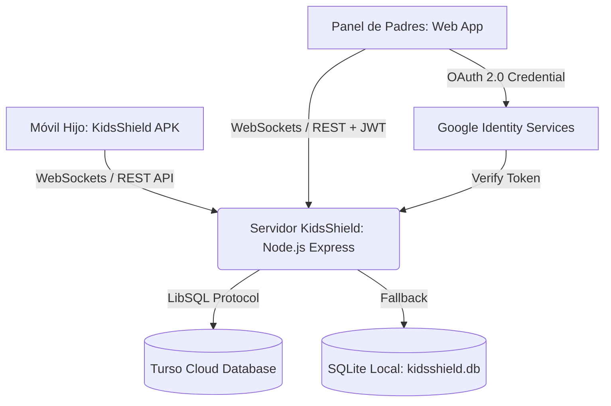

# 🛡️ KidsShield — Plataforma Integral de Control Parental y Bienestar Digital

[](https://nodejs.org/)
[-brightgreen.svg)](https://developer.android.com/)
[](https://turso.tech/)
[](#-seguridad-y-autenticación)
[](#)

**KidsShield** es una solución tecnológica avanzada y lista para producción diseñada para proteger a niños, niñas y adolescentes en el entorno digital. Combina una aplicación nativa para Android con servicios en segundo plano de alta resiliencia y un panel de control para padres con diseño de vanguardia, sincronización en tiempo real mediante WebSockets y base de datos distribuida en la nube con **Turso (LibSQL)**.

---

## 📑 Tabla de Contenidos

- [Características Principales](#-características-principales)
- [Arquitectura del Sistema](#-arquitectura-del-sistema)
- [Seguridad y Autenticación](#-seguridad-y-autenticación)
- [Modelo de Monetización y Planes](#-modelo-de-monetización-y-planes)
- [Requisitos del Sistema](#-requisitos-del-sistema)
- [Guía de Instalación y Despliegue](#-guía-de-instalación-y-despliegue)
  - [1. Configuración del Servidor y Base de Datos](#1-configuración-del-servidor-y-base-de-datos)
  - [2. Configuración de Google OAuth 2.0](#2-configuración-de-google-oauth-20)
  - [3. Instalación de la App Android en el Teléfono del Menor](#3-instalación-de-la-app-android-en-el-teléfono-del-menor)
- [Modo Micrófono y Monitoreo en Vivo](#-modo-micrófono-y-monitoreo-en-vivo)
- [Estructura del Repositorio](#-estructura-del-repositorio)
- [Recompilación de la App Android](#-recompilación-de-la-app-android)

---

## ✨ Características Principales

- 🔒 **Bloqueo Instantáneo y Resiliente**: Bloqueo remoto del dispositivo en menos de 1 segundo mediante WebSockets y servicios nativos de accesibilidad y superposición de pantalla (`Draw over apps`).
- ⏱️ **Límites de Uso y Horarios de Descanso (Bedtime)**: Asignación de tiempo límite diario global o por categoría de app, con bloqueo automático nocturno.
- 🚫 **Gestión y Bloqueo de Aplicaciones**: Detección inmediata de aplicaciones no permitidas (TikTok, Roblox, redes sociales) cerrándolas al instante.
- 🎙️ **Modo Micrófono en Vivo**: Monitor ambiental en tiempo real con analizador de audio visual mediante Web Audio API para verificación de entorno seguro.
- 📍 **Geolocalización en Tiempo Real**: Visualización de ubicación y estado de conectividad en mapa interactivo.
- 🔋 **Telemetría y Estado de Batería**: Monitoreo constante del nivel de carga, conexión a internet y última actividad del menor.
- 👨‍👩‍👧‍👦 **Arquitectura Multi-Familia**: Aislamiento estricto de datos; cada padre administra su propio núcleo familiar e hijos sin cruce de información.
- ☁️ **Base de Datos Distribuida en la Nube**: Integración nativa con **Turso (LibSQL)** para alta disponibilidad y baja latencia global, con fallback automático a SQLite local.

---

## 🏗️ Arquitectura del Sistema



1. **`child-android-app/`**: Aplicación nativa Android (Java 17, SDK 34) implementando:
   - `AccessibilityService`: Monitoreo de ventanas en primer plano y detección de apps restringidas.
   - `UsageStatsManager`: Conteo preciso de minutos de pantalla.
   - `DeviceAdminReceiver`: Protección contra desinstalación forzada.
   - `ForegroundService`: Persistencia de conexión WebSocket y reintentos automáticos.
2. **`server/`**: Servidor Node.js backend con:
   - Motor de WebSockets (`ws`) bidireccional y de baja latencia.
   - Endpoints REST para autenticación, gestión de reglas y telemetría.
   - Cliente `@libsql/client` para persistencia en Turso y soporte local offline.
3. **`parent-dashboard/`**: Single Page Application moderna con estética Glassmorphism, animaciones interactivas, renderizado de mapas y visualizadores de audio en tiempo real.

---

## 🔐 Seguridad y Autenticación

KidsShield ha sido diseñado bajo estándares estrictos de seguridad para entornos productivos:

- **Sin PINs Maestros Inseguros**: Se eliminaron completamente los códigos estáticos o vulnerables.
- **Autenticación con Google OAuth 2.0**: Integración nativa con Google Identity Services con verificación de firmas de tokens en backend.
- **Autenticación Clásica Robusta**: Soporte para correo/contraseña con cifrado unidireccional `bcryptjs` (salt rounds altos).
- **Sesiones con JWT**: Tokens JSON Web Tokens con tiempo de expiración y firma segura configurable mediante `JWT_SECRET`.
- **Cero Datos Ficticios**: El panel de control no genera usuarios ni dispositivos simulados; muestra el estado verídico de la base de datos ("Sin dispositivo vinculado" hasta completar la vinculación real).

---

## 💰 Modelo de Monetización y Planes

El sistema incluye estructura de datos y gestión de suscripciones para familias:

| Plan | Dispositivos | Funcionalidades | Precio Sugerido |
| :--- | :---: | :--- | :---: |
| **Básico (Trial)** | 1 Teléfono | Bloqueo remoto, monitoreo de batería y límite de tiempo básico. | Gratis / 14 días |
| **Pro Familiar** | Hasta 5 Teléfonos | Reglas por app, Bedtime automático, geolocalización continua y alertas. | $4.99 USD / mes |
| **Total Family + Audio** | Ilimitados | Todo lo anterior + Escucha remota / Modo Micrófono en tiempo real, capturas remotas y soporte prioritario. | $9.99 USD / mes |

---

## 📋 Requisitos del Sistema

### Servidor / Panel Web:
- **Node.js**: Versión 18.0.0 o superior.
- **NPM**: Versión 8.0.0 o superior.
- **Conexión a Internet**: Para sincronización con Turso Cloud y Google Auth.

### Dispositivo del Menor (Android):
- **Sistema Operativo**: Android 8.0 (Oreo / API 26) hasta Android 14 (Upside Down Cake / API 34).
- **Servicios de Google Play**: Compatibilidad total.

---

## 🚀 Guía de Instalación y Despliegue

### 1. Configuración del Servidor y Base de Datos

1. Clona o descarga el repositorio en tu máquina:
   ```bash
   git clone https://github.com/sebastianbriones-g/KidsShield.git
   cd KidsShield
   ```
2. Instala las dependencias del servidor:
   ```bash
   cd server
   npm install
   ```
3. Configura las variables de entorno creando o editando el archivo `server/.env`:
   ```env
   PORT=3000
   JWT_SECRET=tu_clave_secreta_super_segura_2026
   TURSO_DATABASE_URL=libsql://tu-base-de-datos.turso.io
   TURSO_AUTH_TOKEN=tu_token_de_autenticacion_turso
   GOOGLE_CLIENT_ID=tu_cliente_id_google.apps.googleusercontent.com
   ```
   *(Si omites las credenciales de Turso, el servidor utilizará automáticamente SQLite local en `server/kidsshield.db`)*.

4. Inicia el servidor:
   ```bash
   npm start
   ```
   *O haz doble clic en `iniciar-panel.bat` en Windows.*
5. Accede al panel en tu navegador:
   👉 **http://localhost:3000**

---

### 2. Configuración de Google OAuth 2.0

Para habilitar el botón oficial de inicio de sesión con Google:
1. Ve a [Google Cloud Console](https://console.cloud.google.com/) y crea un proyecto.
2. Configura la **Pantalla de consentimiento de OAuth** (agrega tu dominio o `http://localhost:3000`).
3. En **Credenciales**, crea un **ID de cliente de OAuth 2.0** tipo *Aplicación web*.
4. Agrega como orígenes de JavaScript autorizados:
   - `http://localhost:3000`
   - `http://127.0.0.1:3000`
5. En el panel de KidsShield, haz clic en **"Configurar Google Client ID"**, pega tu Client ID y guarda. ¡El botón de Google se activará al instante!

---

### 3. Instalación de la App Android en el Teléfono del Menor

1. Transfiere el archivo **`KidsShield-v1.0.0-release.apk`** al teléfono del menor (vía USB, WhatsApp, descarga directa desde el navegador).
2. Toca el archivo descargado para comenzar la instalación y autoriza **"Instalar desde esta fuente"**.
3. **Alerta de Google Play Protect:**
   - Si el dispositivo muestra una advertencia de aplicación desconocida, pulsa en **"Más detalles"** (o flecha ▾).
   - Selecciona **"Instalar de todas formas"**.
4. Abre **KidsShield** y otorga los permisos guiados en pantalla:
   - ✅ **Acceso a Datos de Uso**: Para contabilizar el tiempo en pantalla.
   - ✅ **Superposición (Draw over apps)**: Para mostrar la pantalla de bloqueo cuando expire el límite.
   - ✅ **Servicio de Accesibilidad**: Detección de apertura de aplicaciones restringidas.
   - ✅ **Administrador de Dispositivo**: Protección para evitar que el menor desinstale la aplicación.
5. Escanea el código QR desde el panel web o ingresa el código de vinculación familiar para conectar el teléfono en tiempo real.

---

## 🎙️ Modo Micrófono y Monitoreo en Vivo

El panel web incorpora una tarjeta de monitoreo de audio en vivo:
1. Permite iniciar una escucha de control ambiental para situaciones de emergencia o alerta de seguridad.
2. Muestra un analizador de espectro de frecuencias en tiempo real generado por **Web Audio API**.
3. Notifica inmediatamente al padre el nivel de decibelios y presencia de ruido en el entorno del menor.

---

## 📁 Estructura del Repositorio

```text
KidsShield/
├── KidsShield-v1.0.0.apk           # Binario APK listo para instalar
├── KidsShield-v1.0.0-release.apk   # Binario APK firmado para producción
├── iniciar-panel.bat               # Script de inicio rápido para Windows
├── README.md                       # Documentación principal en español
├── LEEME.md                        # Documentación complementaria
├── .gitignore                      # Reglas de exclusión para Git
├── parent-dashboard/               # Frontend del Panel de Control de Padres
│   ├── index.html                  # Interfaz principal con Glassmorphism
│   ├── app.js                      # Lógica cliente, WebSockets, Audio API y Auth
│   └── styles.css                  # Hoja de estilos con variables y diseño responsive
├── server/                         # Backend en Node.js
│   ├── index.js                    # Servidor Express, WebSockets y controladores
│   ├── db.js                       # Capa de datos Turso LibSQL / SQLite
│   ├── package.json                # Dependencias del servidor
│   └── .env.example                # Plantilla de variables de entorno
└── child-android-app/              # Código fuente nativo de la app Android
    ├── app/                        # Módulo principal Android (Java 17, SDK 34)
    ├── build.gradle                # Configuración de compilación Gradle
    └── gradlew.bat                 # Wrapper de Gradle para compilación
```

---

## 🛠️ Recompilación de la App Android

Si deseas realizar modificaciones en la aplicación nativa (`child-android-app/`):

1. Asegúrate de tener instalado **JDK 17** y **Android SDK Build Tools 34.0.0**.
2. Compila el paquete de release:
   ```powershell
   cd child-android-app
   .\gradlew.bat assembleRelease
   ```
3. El APK optimizado y firmado se generará en:
   ```text
   child-android-app\app\build\outputs\apk\release\app-release.apk
   ```

---

## 📄 Licencia y Aviso Legal

Este software ha sido diseñado con fines exclusivos de control parental, bienestar digital y supervisión de menores de edad bajo la tutela de sus padres o tutores legales. El uso no autorizado o con fines de vigilancia ilícita está estrictamente prohibido.
