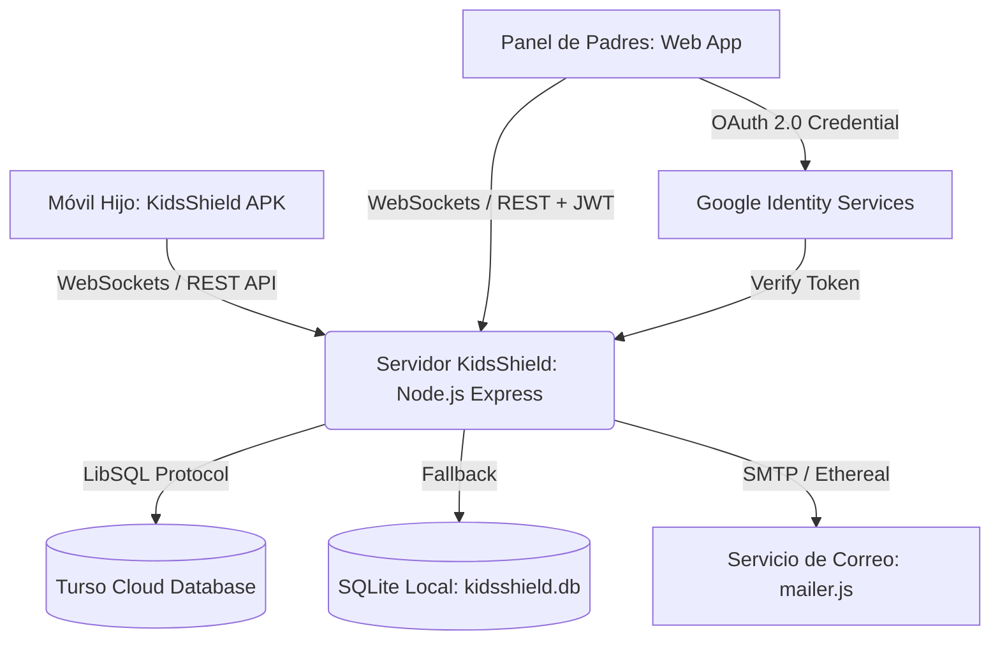

# 🛡️ KidsShield — Plataforma Integral de Control Parental y Bienestar Digital

[](https://nodejs.org/)
[-brightgreen.svg)](https://developer.android.com/)
[](https://turso.tech/)
[](#-seguridad-y-autenticación)
[](#-recuperación-de-contraseña-y-correos)
[](#)

**KidsShield** es una solución tecnológica avanzada y lista para producción diseñada para proteger a niños, niñas y adolescentes en el entorno digital. Combina una aplicación nativa para Android con servicios en segundo plano de alta resiliencia y un panel de control para padres con diseño de vanguardia, sincronización en tiempo real mediante WebSockets, recuperación de contraseña por correo electrónico, compatibilidad con redes Tailscale / LAN y base de datos distribuida en la nube con **Turso (LibSQL)**.

---

## 📑 Tabla de Contenidos

- [Características Principales](#-características-principales)
- [Arquitectura del Sistema](#-arquitectura-del-sistema)
- [Seguridad y Autenticación](#-seguridad-y-autenticación)
- [Recuperación de Contraseña y Correos](#-recuperación-de-contraseña-y-correos)
- [Modelo de Monetización y Planes](#-modelo-de-monetización-y-planes)
- [Requisitos del Sistema](#-requisitos-del-sistema)
- [Guía de Instalación y Despliegue](#-guía-de-instalación-y-despliegue)
  - [1. Configuración del Servidor y Base de Datos](#1-configuración-del-servidor-y-base-de-datos)
  - [2. Configuración de Google OAuth 2.0](#2-configuración-de-google-oauth-20)
  - [3. Instalación de la App Android en el Teléfono del Menor (Asistente de 6 Pasos)](#3-instalación-de-la-app-android-en-el-teléfono-del-menor-asistente-de-6-pasos)
  - [4. Conectividad Remota con Tailscale o Red Local](#4-conectividad-remota-con-tailscale-o-red-local)
- [Desvinculación y Liberación Remota](#-desvinculación-y-liberación-remota)
- [Modo Micrófono y Monitoreo en Vivo](#-modo-micrófono-y-monitoreo-en-vivo)
- [Estructura del Repositorio](#-estructura-del-repositorio)
- [Recompilación de la App Android](#-recompilación-de-la-app-android)

---

## ✨ Características Principales

- 🔒 **Bloqueo Instantáneo y Resiliente**: Bloqueo remoto del dispositivo en menos de 1 segundo mediante WebSockets y servicios nativos de accesibilidad y superposición de pantalla (`Draw over apps`).
- 🚀 **Asistente Inteligente de Permisos Android (6 Pasos)**: Interfaz en el móvil del menor que guía paso a paso al padre o tutor para conceder los permisos del sistema con un solo botón inteligente (*"Otorgar Siguiente Permiso Faltante"*).
- ⏱️ **Límites de Uso y Horarios de Descanso (Bedtime)**: Asignación de tiempo límite diario global o por categoría de app, con bloqueo automático nocturno programable.
- 🚫 **Gestión y Bloqueo de Aplicaciones**: Detección inmediata de aplicaciones no permitidas (TikTok, Roblox, redes sociales) cerrándolas al instante.
- 📍 **Geolocalización Ininterrumpible y Protección GPS**: Monitoreo de ubicación continua en mapa interactivo satelital con detección e impedimento activo de intentos de desactivación de GPS.
- 📧 **Recuperación Segura de Contraseña por Correo**: Sistema con tokens de seguridad criptográficos de 60 minutos de vigencia y plantillas de correo HTML responsivas profesionales vía Nodemailer (SMTP real o Ethereal Mail para pruebas locales).
- 🔓 **Desvinculación y Liberación Remota**: Botón para eliminar o desvincular un dispositivo desde el panel de padres, enviando órdenes inmediatas (`UNLINK_DEVICE` y `UNLOCK_DEVICE`) para restablecer el teléfono del menor a su estado habitual y purgar su historial.
- 🎙️ **Modo Micrófono en Vivo**: Monitor ambiental en tiempo real con analizador de audio visual mediante Web Audio API para verificación de entorno seguro.
- 🔋 **Telemetría y Estado de Batería**: Monitoreo constante del nivel de carga, conexión a internet y última actividad del menor.
- 🌐 **Soporte Tailscale / Red Local**: Detección automática de IPs de Tailscale y LAN para emparejamiento y control del dispositivo tanto dentro como fuera de casa sin necesidad de abrir puertos inseguros.
- 👨‍👩‍👧‍👦 **Arquitectura Multi-Familia con Google Auth**: Aislamiento estricto de datos por familia; sincronización automática de foto de perfil y nombre real desde Google Identity Services.
- ☁️ **Base de Datos Distribuida en la Nube**: Integración nativa con **Turso (LibSQL)** para alta disponibilidad y baja latencia global, con fallback automático a SQLite local (`server/kidsshield.db`).

---

## 🏗️ Arquitectura del Sistema



1. **`child-android-app/`**: Aplicación nativa Android (Java 17, SDK 34) implementando:
   - `AccessibilityService`: Monitoreo de ventanas en primer plano, bloqueo de apps restringidas y prevención de apagado de GPS.
   - `UsageStatsManager`: Conteo preciso de minutos de pantalla por paquete.
   - `DeviceAdminReceiver`: Protección contra desinstalación forzada.
   - `ForegroundService`: Persistencia de conexión WebSocket, telemetría y reintentos automáticos.
   - `PowerManager`: Exclusión de optimización de batería (Whitelist Doze) para funcionamiento ininterrumpido.
2. **`server/`**: Servidor Node.js backend con:
   - Motor de WebSockets (`ws`) bidireccional y de baja latencia.
   - Endpoints REST para autenticación, gestión de reglas, telemetría y geofencing.
   - Cliente `@libsql/client` para persistencia en Turso y soporte local offline.
   - Módulo `mailer.js` con soporte para SMTP de producción y auto-cuenta Ethereal en desarrollo.
3. **`parent-dashboard/`**: Single Page Application moderna con estética Glassmorphism, animaciones interactivas, renderizado de mapas interactivos, visualizadores de audio en tiempo real y modal de recuperación de contraseñas.

---

## 🔐 Seguridad y Autenticación

KidsShield ha sido diseñado bajo estándares estrictos de seguridad para entornos productivos:

- **Sin PINs Maestros Inseguros**: Se eliminaron completamente los códigos estáticos o vulnerables.
- **Autenticación con Google OAuth 2.0**: Integración nativa con Google Identity Services con verificación criptográfica en backend y sincronización de foto y nombre de perfil.
- **Autenticación Clásica Robusta**: Soporte para correo/contraseña con cifrado unidireccional `bcryptjs` (salt rounds altos).
- **Sesiones con JWT**: Tokens JSON Web Tokens con tiempo de expiración y firma segura configurable mediante `JWT_SECRET`.
- **Tokens Temporales de Restablecimiento**: Generación de tokens seguros y de uso único con caducidad automática a los 60 minutos.
- **Cero Datos Ficticios**: El panel de control no genera usuarios ni dispositivos simulados; muestra el estado verídico de la base de datos ("Sin dispositivo vinculado" hasta completar la vinculación real).

---

## 📧 Recuperación de Contraseña y Correos

El servidor incluye un módulo dedicado de mensajería transaccional (`server/mailer.js`):

1. **Modo Producción**: Al configurar variables de entorno SMTP (`SMTP_HOST`, `SMTP_PORT`, `SMTP_USER`, `SMTP_PASS`), los correos se envían a través de tu proveedor de correo habitual (Gmail, SendGrid, Amazon SES, Mailgun, etc.).
2. **Modo Desarrollo / Pruebas**: Si no configuras variables SMTP, KidsShield crea automáticamente una cuenta de pruebas gratuita en **Ethereal Email** e imprime en la consola del servidor el enlace web directo para previsualizar el correo generado.
3. **Plantilla HTML de Alto Nivel**: Incluye diseño en modo oscuro con gradientes, logotipo de seguridad, botón interactivo directo y advertencias claras de expiración.

---

## 💰 Modelo de Monetización y Planes

El sistema incluye estructura de datos y gestión de suscripciones para familias:

| Plan | Dispositivos | Funcionalidades | Precio Sugerido |
| :--- | :---: | :--- | :---: |
| **Básico (Trial)** | 1 Teléfono | Bloqueo remoto, monitoreo de batería y límite de tiempo básico. | Gratis / 14 días |
| **Pro Familiar** | Hasta 5 Teléfonos | Reglas por app, Bedtime automático, geolocalización continua y alertas. | $4.99 USD / mes |
| **Total Family + Audio** | Ilimitados | Todo lo anterior + Escucha remota / Modo Micrófono en tiempo real, capturas remotas y soporte prioritario. | $9.99 USD / mes |

---

## 📋 Requisitos del Sistema

### Servidor / Panel Web:
- **Node.js**: Versión 18.0.0 o superior.
- **NPM**: Versión 8.0.0 o superior.
- **Conexión a Internet**: Para sincronización con Turso Cloud, Google Auth y envío de correos.

### Dispositivo del Menor (Android):
- **Sistema Operativo**: Android 8.0 (Oreo / API 26) hasta Android 14 (Upside Down Cake / API 34).
- **Servicios de Google Play**: Compatibilidad total.

---

## 🚀 Guía de Instalación y Despliegue

### 1. Configuración del Servidor y Base de Datos

1. Clona o descarga el repositorio en tu máquina:
   ```bash
   git clone https://github.com/sebastianbriones-g/KidsShield.git
   cd KidsShield
   ```
2. Instala las dependencias del servidor:
   ```bash
   cd server
   npm install
   ```
3. Configura las variables de entorno creando o editando el archivo `server/.env`:
   ```env
   PORT=3000
   JWT_SECRET=tu_clave_secreta_super_segura_2026

   # Base de Datos Distribuida (Opcional - Fallback a SQLite local)
   TURSO_DATABASE_URL=libsql://tu-base-de-datos.turso.io
   TURSO_AUTH_TOKEN=tu_token_de_autenticacion_turso

   # Google OAuth 2.0 (Opcional)
   GOOGLE_CLIENT_ID=tu_cliente_id_google.apps.googleusercontent.com

   # Servidor SMTP de Correo (Opcional - Fallback automático a Ethereal Email)
   SMTP_HOST=smtp.gmail.com
   SMTP_PORT=587
   SMTP_SECURE=false
   SMTP_USER=tucorreo@gmail.com
   SMTP_PASS=tu_contraseña_de_aplicacion
   SMTP_FROM="KidsShield Soporte" <soporte@tudominio.com>
   ```

4. Inicia el servidor:
   ```bash
   npm start
   ```
   *O haz doble clic en `iniciar-panel.bat` en Windows.*

5. Accede al panel en tu navegador:
   👉 **http://localhost:3000**

---

### 2. Configuración de Google OAuth 2.0

Para habilitar el botón oficial de inicio de sesión con Google:
1. Ve a [Google Cloud Console](https://console.cloud.google.com/) y crea un proyecto.
2. Configura la **Pantalla de consentimiento de OAuth** (agrega tu dominio o `http://localhost:3000`).
3. En **Credenciales**, crea un **ID de cliente de OAuth 2.0** tipo *Aplicación web*.
4. Agrega como orígenes de JavaScript autorizados:
   - `http://localhost:3000`
   - `http://127.0.0.1:3000`
5. En el panel de KidsShield, haz clic en **"Configurar Google Client ID"**, pega tu Client ID y guarda. ¡El botón de Google se activará al instante!

---

### 3. Instalación de la App Android en el Teléfono del Menor (Asistente de 6 Pasos)

1. Transfiere el archivo **`KidsShield-v1.0.apk`** (o `KidsShield-v1.0.0-release.apk`) al teléfono del menor.
2. Toca el archivo descargado para comenzar la instalación y autoriza **"Instalar desde esta fuente"**.
3. **Alerta de Google Play Protect:**
   - Si el dispositivo muestra una advertencia de aplicación desconocida, pulsa en **"Más detalles"** (o flecha ▾).
   - Selecciona **"Instalar de todas formas"**.
4. Abre **KidsShield**. El nuevo **Asistente de Permisos Guiado** verificará automáticamente cada permiso y te permitirá concederlos con el botón *"Otorgar Siguiente Permiso Faltante"*:
   - 1️⃣ **Acceso a Datos de Uso (Usage Access)**: Contabiliza con exactitud los minutos utilizados en apps, redes sociales y juegos.
   - 2️⃣ **Servicio de Accesibilidad (A11y)**: Detección instantánea en milisegundos de aplicaciones bloqueadas y protección del GPS.
   - 3️⃣ **Superposición en Pantalla (Draw Over Apps)**: Despliega la pantalla de bloqueo seguro sobre cualquier aplicación cuando venza el horario o límite.
   - 4️⃣ **Ubicación GPS Satelital Ininterrumpible**: Rastreo continuo 24/7 y prevención de desactivación por parte del menor.
   - 5️⃣ **Administrador de Dispositivo (Device Admin)**: Previene que el menor desinstale la aplicación o fuerce su detención.
   - 6️⃣ **Sin Restricción de Batería (Segundo Plano)**: Evita que el sistema operativo mate el proceso en segundo plano para ahorrar energía.
5. Escanea el código QR desde el panel web o ingresa el código de vinculación familiar para conectar el teléfono en tiempo real.

---

### 4. Conectividad Remota con Tailscale o Red Local

El servidor detecta automáticamente tu dirección IP local y tu IP de la red privada **Tailscale**:

* **En casa:** Si ambos dispositivos están en la misma red Wi-Fi, la app se conecta a la IP local del servidor (ej. `http://192.168.1.50:3000`).
* **Fuera de casa (Tailscale VPN):** Al instalar Tailscale en el PC servidor y en el móvil del menor, ambos se comunican de forma segura a través de la IP de Tailscale (ej. `http://100.x.y.z:3000` o `http://note:3000`) desde cualquier lugar del mundo sin exponer puertos al internet público.

---

## 🔓 Desvinculación y Liberación Remota

Si decides transferir el teléfono, cambiar de dispositivo o desactivar temporalmente el control parental:
1. Desde el panel web de padres, haz clic en **"Desvincular Dispositivo"** o elimina el perfil del menor.
2. El servidor marcará el dispositivo como desvinculado, limpiará su historial de ubicaciones y eventos de Turso Cloud, y enviará en tiempo real la orden `UNLINK_DEVICE` y `UNLOCK_DEVICE`.
3. El teléfono del menor cerrará inmediatamente la pantalla de bloqueo y restaurará los accesos de inmediato, sin requerir reinicios forzados.

---

## 🎙️ Modo Micrófono y Monitoreo en Vivo

El panel web incorpora una tarjeta de monitoreo de audio en vivo:
1. Permite iniciar una escucha de control ambiental para situaciones de emergencia o alerta de seguridad.
2. Muestra un analizador de espectro de frecuencias en tiempo real generado por **Web Audio API**.
3. Notifica inmediatamente al padre el nivel de decibelios y presencia de ruido en el entorno del menor.

---

## 📁 Estructura del Repositorio

```text
KidsShield/
├── KidsShield-v1.0.apk             # Binario APK v1.0 listo para instalar
├── KidsShield-v1.0.0.apk           # Binario APK estándar
├── KidsShield-v1.0.0-release.apk   # Binario APK firmado para producción
├── iniciar-panel.bat               # Script de inicio rápido con detección de IPs para Windows
├── README.md                       # Documentación principal en español
├── LEEME.md                        # Documentación complementaria sincronizada
├── .gitignore                      # Reglas de exclusión para Git
├── parent-dashboard/               # Frontend del Panel de Control de Padres
│   ├── index.html                  # Interfaz con Glassmorphism y modal de recuperación
│   ├── app.js                      # Lógica cliente, WebSockets, Audio API, Auth y Reset
│   ├── style.css                   # Hoja de estilos con tokens CSS y diseño responsive
│   └── KidsShield-v1.0.apk         # Copia directa descargable desde el panel web
├── server/                         # Backend en Node.js
│   ├── index.js                    # Servidor Express, WebSockets y controladores de API
│   ├── db.js                       # Capa de datos Turso LibSQL / SQLite
│   ├── mailer.js                   # Módulo de correos con nodemailer y plantillas HTML
│   ├── package.json                # Dependencias del servidor (express, ws, nodemailer, etc.)
│   └── .env.example                # Plantilla de variables de entorno
└── child-android-app/              # Código fuente nativo de la app Android
    ├── app/                        # Módulo principal Android (Java 17, SDK 34)
    ├── build.gradle                # Configuración de compilación Gradle
    └── gradlew.bat                 # Wrapper de Gradle para compilación
```

---

## 🛠️ Recompilación de la App Android

Si deseas realizar modificaciones en la aplicación nativa (`child-android-app/`):

1. Asegúrate de tener instalado **JDK 17** y **Android SDK Build Tools 34.0.0**.
2. Compila el paquete de release:
   ```powershell
   cd child-android-app
   .\gradlew.bat assembleRelease
   ```
3. El APK optimizado y firmado se generará en:
   ```text
   child-android-app\app\build\outputs\apk\release\app-release.apk
   ```

---

## 📄 Licencia y Aviso Legal

Este software ha sido diseñado con fines exclusivos de control parental, bienestar digital y supervisión de menores de edad bajo la tutela de sus padres o tutores legales. El uso no autorizado o con fines de vigilancia ilícita está estrictamente prohibido.
