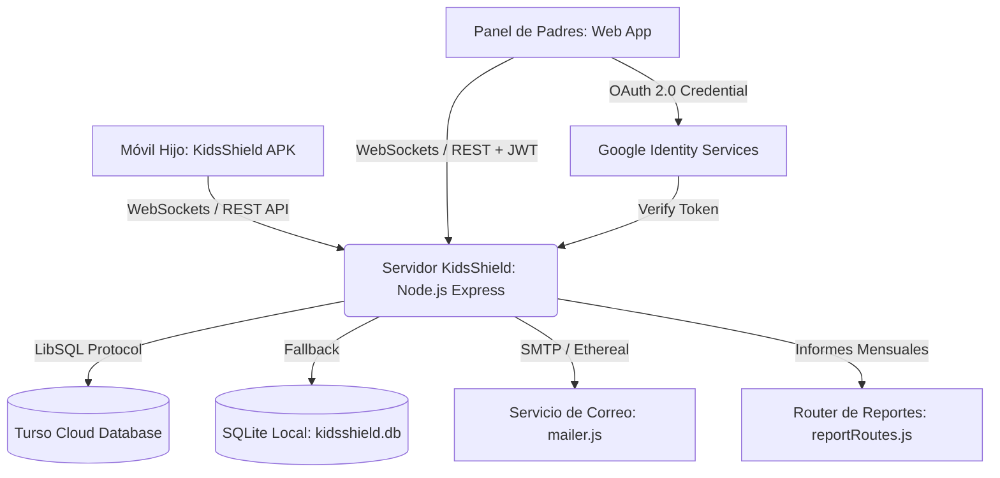

# 🛡️ KidsShield — Plataforma Integral de Control Parental y Bienestar Digital

[](https://nodejs.org/)
[-brightgreen.svg)](https://developer.android.com/)
[](https://turso.tech/)
[](#-seguridad-y-autenticación)
[](#-recuperación-de-contraseña-y-correos)
[](#-informes-mensuales-de-uso-y-bienestar-digital)
[](#)

**KidsShield** es una solución tecnológica avanzada y lista para producción diseñada para proteger a niños, niñas y adolescentes en el entorno digital. Combina una aplicación nativa para Android con servicios en segundo plano de alta resiliencia y un panel de control para padres con diseño de vanguardia, sincronización en tiempo real mediante WebSockets, generación automática de informes mensuales con despacho por correo electrónico y descarga PDF, recuperación de contraseña, compatibilidad con redes Tailscale / LAN y base de datos distribuida en la nube con **Turso (LibSQL)**.

---

## 📑 Tabla de Contenidos

- [Características Principales](#-características-principales)
- [Arquitectura del Sistema](#-arquitectura-del-sistema)
- [Seguridad y Autenticación](#-seguridad-y-autenticación)
- [Informes Mensuales de Uso y Bienestar Digital](#-informes-mensuales-de-uso-y-bienestar-digital)
- [Navegación Unificada y Vinculación QR](#-navegación-unificada-y-vinculación-qr)
- [Centro de Configuración y Facturación](#-centro-de-configuración-y-facturación)
- [Recuperación de Contraseña y Correos](#-recuperación-de-contraseña-y-correos)
- [Gestión de Aplicaciones Instaladas y Catálogo Canónico](#-gestión-de-aplicaciones-instaladas-y-catálogo-canónico)
- [Línea de Tiempo y Filtros por Aplicación](#-línea-de-tiempo-y-filtros-por-aplicación)
- [Modelo de Monetización y Planes](#-modelo-de-monetización-y-planes)
- [Lugares y Geocercas Seguras con Selección en Mapa](#-lugares-y-geocercas-seguras-con-selección-en-mapa)
- [Captura Automática y Multimedia en Tiempo Real](#-captura-automática-y-multimedia-en-tiempo-real)
- [Bloqueo Infranqueable en la App Android](#-bloqueo-infranqueable-en-la-app-android)
- [Requisitos del Sistema](#-requisitos-del-sistema)
- [Monitoreo en Tiempo Real de Aplicaciones Activas](#-monitoreo-en-tiempo-real-de-aplicaciones-activas)
- [Traza GPS Diaria, Control de Frecuencia Satelital y Alertas](#-traza-gps-diaria-control-de-frecuencia-satelital-y-alertas)
- [Duración Dinámica de Audio y Video (5s, 7s, 10s)](#-duración-dinámica-de-audio-y-video-5s-7s-10s)
- [Sincronización de Bloqueo, Tiempo de Pantalla e Historial](#-sincronización-de-bloqueo-tiempo-de-pantalla-e-historial)
- [Guía de Instalación y Despliegue](#-guía-de-instalación-y-despliegue)
  - [1. Configuración del Servidor y Base de Datos](#1-configuración-del-servidor-y-base-de-datos)
  - [2. Configuración de Google OAuth 2.0](#2-configuración-de-google-oauth-20)
  - [3. Instalación de la App Android en el Teléfono del Menor (Asistente de 6 Pasos)](#3-instalación-de-la-app-android-en-el-teléfono-del-menor-asistente-de-6-pasos)
  - [4. Conectividad Remota con Tailscale o Red Local](#4-conectividad-remota-con-tailscale-o-red-local)
- [Desvinculación y Liberación Remota](#-desvinculación-y-liberación-remota)
- [Modo Micrófono y Monitoreo en Vivo](#-modo-micrófono-y-monitoreo-en-vivo)
- [Estructura del Repositorio](#-estructura-del-repositorio)
- [Recompilación de la App Android](#-recompilación-de-la-app-android)

---

## ✨ Características Principales

- 📑 **Informes Mensuales de Uso y Seguridad Digital Automáticos**: Pestaña dedicada para emitir balances ejecutivos mensuales por hijo, con métricas agregadas (tiempo total, promedio diario, días supervisados, alertas de seguridad), barras de progreso por categoría, top de aplicaciones y conclusiones pedagógicas automatizadas. Incluye descarga/impresión A4 (`@media print`) y envío directo por correo electrónico con plantilla HTML profesional vía Nodemailer.
- ⏱️ **Tiempo de Pantalla Real e Independiente por Hijo**: Medición fidedigna y aislada del tiempo de uso en primer plano para cada menor, sin mezclas de datos ni arrastres al cambiar de dispositivo en el panel.
- 🧒 **Selección Interactiva de Hijos en el Resumen**: Tarjetas de menores interactivas con un solo clic, resaltadas con contorno iluminado y la insignia destacada **`👁️ Supervisando ahora`**.
- ⏱️ **Límites de Pantalla Diario Simplificado**: Sección focalizada exclusivamente en el límite diario total de pantalla, manteniendo el horario nocturno (Modo Descanso) de forma ordenada en la pestaña de Configuración.
- 📱 **Catálogo Canónico de 8 Categorías de Aplicaciones**: Sincronización exacta entre las píldoras de filtro (`#categoryFilter`) y los selectores desplegables individuales de cada app (`.app-category-select`):
  `🎮 Juegos`, `📱 Redes Sociales`, `🎬 Videos`, `🌐 Navegación Web`, `🎓 Educación`, `💬 Comunicación`, `📁 Utilidades`, `⚙️ Sistema`.
- 🎨 **Rediseño Ergonómico de Gestión de Aplicaciones**: Filas (`.app-row`) con diseño moderno en tres bloques limpios, iconos estilizados, etiquetas superiores en los controles, límites diarios individuales y botón de bloqueo de alto contraste.
- 🕒 **Línea de Tiempo y Chips Simplificados**: Barra agrupada que evita el desbordamiento de decenas de botones individuales, combinando el chip rápido `🌐 Todas`, las 3 aplicaciones más activas y un selector desplegable alfabético `🔍 Más aplicaciones...`.
- 🧭 **Navegación Unificada Lateral**: Sidebar optimizado con estructura clara (Resumen General, Mi Familia, Dispositivos, Mapa & Geocercas, Multimedia, Historial, Teclado & Textos, Informes y Configuración).
- ⚙️ **Centro de Configuración en 2 Apartados**:
  - **1. Configuración de Dispositivos**: Selector contextual de menor con parámetros de GPS, límite diario de pantalla, modo descanso (Bedtime) y PIN parental.
  - **2. Configuración de Pago y Plan**: Tarjeta bancaria virtual interactiva, modal de actualización, conmutador de **Renovación Automática (Auto-Renew)**, cuota de dispositivos e historial de recibos con descarga PDF.
- 📱 **Vinculación Rápida con Código QR Dinámico**: Generador de QR interactivo en modal emergente que despliega el código de emparejamiento familiar y dirección IP del servidor para sincronización instantánea con la cámara del menor.
- 💎 **Gestión de Membresías y Estado Familiar**: Tarjeta lateral con visualización de nivel de suscripción (*Familia Total VIP 💎* / *Familiar Pro ⚡*) y ajuste reactivo del cupo de dispositivos permitidos.
- 🔒 **Bloqueo Inteligente de Aplicaciones y Dispositivo Unificado**: Control remoto inmediato de aplicaciones individuales o bloqueo total del dispositivo con expulsión instantánea al launcher y pantalla contextual con PIN de rescate.
- 📍 **Geocercas Seguras con Selección en Mapa**: Marcación con un clic en el mapa satelital para capturar coordenadas al vuelo, validación con feedback visual, guardado y eliminación persistente.
- 📸 **Captura Automática Periódica en Multimedia**: Supervisión programada (fotos, clips de vídeo de 5s, grabaciones de audio de 5s o secuencia mixta) con intervalos de 30s a 5min y temporizador en vivo.
- 🔄 **Galería Multimedia en Tiempo Real**: Recepción instantánea de fotos y clips mediante eventos WebSocket dedicados (`MULTIMEDIA_UPDATED`) y peticiones en cascada.
- 👨‍👩‍👧‍👦 **Administración de Perfiles en "Mi Familia"**: Modificación dinámica de nombre del hijo/a, modelo de terminal, tipo (📱 Celular o 📟 Tablet) y avatar interactivo, sincronizado con base de datos en tiempo real.
- 🚀 **Asistente Inteligente de Permisos Android (6 Pasos)**: Guía paso a paso al tutor para conceder los permisos del sistema con un solo botón inteligente (*"Otorgar Siguiente Permiso Faltante"*).
- 📧 **Recuperación Segura de Contraseña por Correo**: Sistema con tokens criptográficos de 60 minutos de vigencia y plantillas de correo HTML responsivas profesionales vía Nodemailer.
- 🗺️ **Traza GPS Diaria con Selector de Fecha**: Historial satelital continuo (Hoy, Ayer o fecha personalizada), trazando la ruta entera en el mapa Leaflet con marcadores de inicio 🏁, última posición 📍 y cálculo de distancia acumulada.
- 🎙️🎬 **Duración Configurable de Audio y Video (5s, 7s, 10s)**: Ajuste dedicado para la escucha ambiental y videos en vivo con reflejo reactivo en los botones de acción.
- 🌐 **Soporte Tailscale / Red Local**: Detección automática de IPs para control tanto dentro como fuera de casa sin abrir puertos inseguros.
- ☁️ **Base de Datos Distribuida en la Nube**: Integración nativa con **Turso (LibSQL)** con fallback automático a SQLite local (`server/kidsshield.db`).

---

## 🏗️ Arquitectura del Sistema



1. **`child-android-app/`**: Aplicación nativa Android (Java 17, SDK 34) implementando:
   - `AccessibilityService`: Monitoreo de ventanas en primer plano, bloqueo de apps restringidas y prevención de apagado de GPS.
   - `UsageStatsManager`: Conteo preciso de minutos de pantalla por paquete.
   - `DeviceAdminReceiver`: Protección contra desinstalación forzada.
   - `ForegroundService`: Persistencia de conexión WebSocket, telemetría y reintentos automáticos.
   - `PowerManager`: Exclusión de optimización de batería (Whitelist Doze) para funcionamiento ininterrumpido.
2. **`server/`**: Servidor Node.js backend modular con:
   - Motor de WebSockets (`ws`) bidireccional y de baja latencia con aislamiento multi-inquilino.
   - Endpoints REST para autenticación (`routes/authRoutes.js`), gestión de dispositivos (`routes/deviceRoutes.js`), suscripciones (`routes/subscriptionRoutes.js`) e informes mensuales (`routes/reportRoutes.js`).
   - Capa de datos con `@libsql/client` para persistencia en Turso Cloud y fallback a SQLite local.
   - Módulo `mailer.js` con soporte para SMTP real (Gmail, Outlook, etc.) y cuenta automática Ethereal en desarrollo.
3. **`parent-dashboard/`**: Single Page Application moderna con estética Glassmorphism, animaciones fluidas, mapas interactivos Leaflet, visualizadores de audio en tiempo real y módulo de informes ejecutivos con soporte `@media print`.

---

## 📑 Informes Mensuales de Uso y Bienestar Digital

KidsShield incorpora un módulo de generación de balances mensuales para brindar a los padres una perspectiva integral sobre los hábitos digitales del menor:

### 1. Métricas Agregadas en Tiempo Real (`GET /api/reports/monthly`)
- **Tiempo Total de Pantalla**: Suma acumulada de minutos de actividad a lo largo del mes seleccionado.
- **Promedio Diario**: Cálculo de horas y minutos promedio durante los días en que el dispositivo estuvo en uso.
- **Días con Actividad**: Recuento de jornadas con conexión y uso registrado.
- **Alertas de Seguridad**: Registro de incidentes de riesgo, aperturas fuera de horario, salidas de geocercas seguras y palabras peligrosas detectadas por el teclado.

### 2. Desglose Visual por Categorías
- Clasificación de todas las aplicaciones en las 8 categorías canónicas (**Juegos**, **Redes Sociales**, **Videos**, **Navegación Web**, **Educación**, **Comunicación**, **Utilidades**, **Sistema**).
- Barras de progreso estilizadas con colores semánticos y porcentaje de impacto sobre el tiempo total del menor.

### 3. Top Aplicaciones Más Utilizadas
- Listado de las 5 aplicaciones predominantes del período con icono, nombre, categoría, tiempo acumulado (`Xh Ym`) y porcentaje del tiempo total.

### 4. Diagnóstico Pedagógico Automatizado
- Consejos automáticos adaptados al patrón de consumo del menor (ej. alerta si el ocio supera el 65% del tiempo, felicitaciones si la categoría Educación supera los 60 minutos, o sugerencia de horarios de descanso si el promedio excede las 3 horas diarias).

### 5. Descarga en PDF y Envío por Correo Electrónico
- **🖨️ Descargar / Imprimir (PDF)**: Activa el diálogo de impresión del navegador con estilos optimizados `@media print`, formateando un documento ejecutivo A4 nítido sin elementos de interfaz redundantes.
- **✉️ Enviar por Correo**: Despacha el informe directamente a la bandeja de entrada del tutor (`POST /api/reports/monthly/send-email`) mediante una plantilla HTML responsiva con encabezado institucional, tablas de métricas, barras de categoría y resumen pedagógico.

---

## 📱 Gestión de Aplicaciones Instaladas y Catálogo Canónico

El panel de control permite supervisar y configurar cada aplicación del teléfono del menor de manera individual:

- **Catálogo Canónico Unificado**: Tanto los filtros superiores como los selectores desplegables de categoría comparten exactamente las 8 categorías canónicas:
  1. 🎮 **Juegos**
  2. 📱 **Redes Sociales**
  3. 🎬 **Videos**
  4. 🌐 **Navegación Web**
  5. 🎓 **Educación**
  6. 💬 **Comunicación**
  7. 📁 **Utilidades**
  8. ⚙️ **Sistema**
- **Clasificación Flexible**: Los padres pueden cambiar la categoría de cualquier aplicación instalada (por ejemplo, reclasificar YouTube de Entretenimiento a Educación, o TikTok a Redes Sociales) y los cambios se guardan de inmediato en el servidor y en la base de datos.
- **Límites Diarios Individuales**: Cada aplicación dispone de un selector para establecer un tope diario de 15m, 30m, 45m, 1h, 1.5h o 2 horas. Al alcanzarse el límite, la app se bloquea automáticamente.
- **Botón de Bloqueo Inmediato**: Permite restringir o permitir el acceso a una aplicación con un solo clic con respuesta visual de alto contraste.

---

## 🕒 Línea de Tiempo y Filtros por Aplicación

La línea de tiempo de eventos en vivo registra aperturas de aplicaciones, bloqueos, alertas y ubicaciones GPS:

- **Filtros por Tipo de Evento**: Píldoras para visualizar Todos, 🛑 Bloqueos, 🚀 Aperturas o ⚠️ Alertas.
- **Filtros por Aplicación Simplificados**:
  - Botón **`🌐 Todas`**: Muestra la actividad cronológica general.
  - **Chips Rápidos**: Accesos directos a las 3 aplicaciones más utilizadas por el menor.
  - **Selector Desplegable `🔍 Más aplicaciones...`**: Menú desplegable ordenado alfabéticamente con la totalidad de aplicaciones detectadas en el teléfono, evitando la saturación horizontal de la interfaz.

---

## 🛡️ Bloqueo Inteligente de Aplicaciones y Dispositivo Unificado

El módulo Android (`child-android-app/`) implementa un sistema unificado y robusto para el bloqueo de aplicaciones individuales y el bloqueo general del dispositivo:

1. **Bloqueo Remoto de Aplicaciones Individuales**:
   - Desde la pestaña de Dispositivos en el panel de padres, el tutor puede bloquear o desbloquear cualquier aplicación detectada.
   - El servidor transmite la orden de inmediato por WebSockets (`COMMAND` con `BLOCK_APP:<pkg>` o `UNBLOCK_APP:<pkg>`) y actualiza la lista sincronizada de aplicaciones bloqueadas.
   - `AppBlockerAccessibilityService`: En cuanto el menor pulsa el icono de la aplicación restringida, el servicio detecta el paquete en primer plano, ejecuta instantáneamente `GLOBAL_ACTION_HOME` para cerrar la aplicación y levanta la pantalla `LockOverlayActivity` indicando el nombre de la app y la razón de bloqueo.

2. **Bloqueo Completo del Dispositivo (Modo Universal "Todas las Apps Detectadas")**:
   - Al activar el bloqueo remoto del dispositivo desde el panel de padres (`isDeviceLocked = true`), el sistema funciona con la misma mecánica que el bloqueo de aplicaciones individuales, pero extendido a **todas las aplicaciones detectadas** en el teléfono del menor.
   - El menor puede visualizar su pantalla de inicio (launcher de Android) e interactuar con el sistema sin congelamientos ni pantallas negras forzadas.
   - Tan pronto el menor intenta abrir **cualquier aplicación** (juegos, navegador, redes sociales, etc.), el servicio de accesibilidad lo detecta al instante, lo expulsa de inmediato al inicio (`GLOBAL_ACTION_HOME`) y muestra la pantalla `LockOverlayActivity` con el aviso *"🔒 Dispositivo Bloqueado"*.
   - El botón **"Volver al inicio"** permanece accesible para que el menor retorne limpiamente al escritorio.

3. **Excepciones de Seguridad y Emergencia Garantizadas**:
   - Por seguridad vital, el sistema de bloqueo permite siempre el acceso a:
     - Teléfono y llamadas de emergencia (`com.android.phone`, marcador telefónico del sistema).
     - Componentes del sistema operativo e interfaz de usuario (`com.android.systemui`).
     - Lanzador de aplicaciones principal (Home launcher dinámico).
     - La propia aplicación de KidsShield para sincronización y configuración parental.
   - Protege activamente la pantalla de Ajustes del sistema (`com.android.settings`) para impedir que se apague el GPS, se desinstale la app o se revoquen los permisos.

---

## 📋 Requisitos del Sistema

### Servidor / Panel Web:
- **Node.js**: Versión 18.0.0 o superior.
- **NPM**: Versión 8.0.0 o superior.
- **Conexión a Internet**: Para sincronización con Turso Cloud, Google Auth y envío de correos.

### Dispositivo del Menor (Android):
- **Sistema Operativo**: Android 8.0 (Oreo / API 26) hasta Android 14 (Upside Down Cake / API 34).
- **Servicios de Google Play**: Compatibilidad total.

---

## 🚀 Guía de Instalación y Despliegue

### 1. Configuración del Servidor y Base de Datos

1. Clona o descarga el repositorio en tu máquina:
   ```bash
   git clone https://github.com/tu-usuario/KidsShield.git
   cd KidsShield
   ```

2. Ingresa al directorio del servidor e instala dependencias:
   ```bash
   cd server
   npm install
   ```

3. Crea el archivo de variables de entorno `.env` en la carpeta `server/`:
   ```env
   PORT=3000
   JWT_SECRET=tu_clave_secreta_jwt_muy_segura
   TURSO_DATABASE_URL=libsql://tu-base-datos.turso.io
   TURSO_AUTH_TOKEN=tu_token_de_autenticacion_turso
   GOOGLE_CLIENT_ID=tu_google_client_id.apps.googleusercontent.com

   # Configuración de Correo Electrónico (SMTP)
   SMTP_HOST=smtp.gmail.com
   SMTP_PORT=587
   SMTP_USER=tu_correo@gmail.com
   SMTP_PASS=tu_contraseña_de_aplicacion
   SMTP_FROM="KidsShield Seguridad Familiar" <tu_correo@gmail.com>
   ```
   > **Nota**: Si dejas las variables `SMTP_*` en blanco, el servidor generará automáticamente una cuenta de prueba gratuita en **Ethereal Mail**, imprimiendo los enlaces directos de previsualización en la consola.

4. Inicia el servidor:
   ```bash
   node index.js
   ```

5. Accede al panel de control desde tu navegador web:
   ```text
   http://localhost:3000
   ```

---

## 📁 Estructura del Repositorio

```text
KidsShield/
├── KidsShield-v1.0.apk             # Binario APK v1.0 listo para instalar
├── KidsShield-v1.0.0.apk           # Binario APK estándar
├── KidsShield-v1.0.0-release.apk   # Binario APK firmado para producción
├── iniciar-panel.bat               # Script de inicio rápido con detección de IPs para Windows
├── README.md                       # Documentación principal en español
├── LEEME.md                        # Documentación complementaria sincronizada
├── .gitignore                      # Reglas de exclusión para Git
├── parent-dashboard/               # Frontend del Panel de Control de Padres
│   ├── index.html                  # Interfaz Glassmorphism, informes mensuales y modales
│   ├── app.js                      # Lógica cliente, WebSockets, reportes, audio y navegación
│   ├── style.css                   # Hoja de estilos con reglas de impresión y temas
│   └── KidsShield-v1.0.apk         # Copia descargable desde el panel web
├── server/                         # Backend en Node.js
│   ├── index.js                    # Servidor Express, montaje de rutas y WebSockets
│   ├── db.js                       # Capa de datos Turso LibSQL / SQLite
│   ├── mailer.js                   # Módulo de correos con nodemailer (reset e informes)
│   ├── package.json                # Dependencias del servidor (express, ws, nodemailer, etc.)
│   ├── routes/                     # Rutas modulares de la API REST
│   │   ├── authRoutes.js           # Registro, login, Google OAuth y recuperación
│   │   ├── deviceRoutes.js         # Telemetría, apps, geocercas, capturas y bloqueo
│   │   ├── reportRoutes.js         # Generación y despacho de informes mensuales
│   │   └── subscriptionRoutes.js   # Gestión de planes, pagos y facturación
│   └── sockets/                    # Gestores de WebSockets
│       └── socketManager.js        # Aislamiento multi-inquilino y eventos en tiempo real
└── child-android-app/              # Código fuente nativo de la app Android
    ├── app/                        # Módulo principal Android (Java 17, SDK 34)
    ├── build.gradle                # Configuración de compilación Gradle
    └── gradlew.bat                 # Wrapper de Gradle para compilación
```

---

## 📄 Licencia y Aviso Legal

Este software ha sido diseñado con fines exclusivos de control parental, bienestar digital y supervisión de menores de edad bajo la tutela de sus padres o tutores legales. El uso no autorizado o con fines de vigilancia ilícita está estrictamente prohibido.
