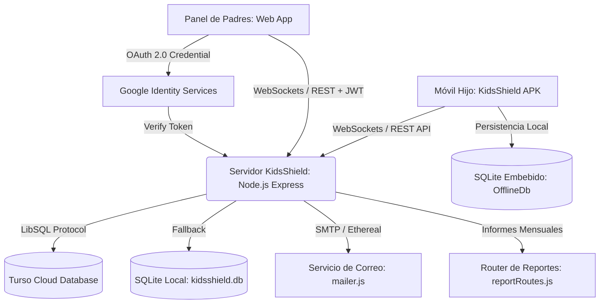

# 🛡️ KidsShield — Plataforma Integral de Control Parental y Bienestar Digital

[](https://nodejs.org/)
[-brightgreen.svg)](https://developer.android.com/)
[](https://turso.tech/)
[](#-seguridad-y-autenticación)
[](#-recuperación-de-contraseña-y-correos)
[](#-informes-mensuales-de-uso-y-bienestar-digital)
[](#)

**KidsShield** es una solución tecnológica integral y de nivel de producción diseñada para el acompañamiento, seguridad y bienestar digital de niños, niñas y adolescentes. Combina una aplicación móvil nativa para Android con arquitectura dual (Asistente de Vinculación QR y Dashboard amigable para el menor), servicios en segundo plano con persistencia y cola offline (SQLite local), un panel de control web con diseño *Glassmorphism* de última generación, sincronización bidireccional por WebSockets con aislamiento multi-inquilino, watchdog inteligente anti-falsas alarmas, generación automática de informes mensuales con despacho por correo y descarga en PDF, y compatibilidad con redes Tailscale / LAN sobre una base de datos distribuida en la nube con **Turso (LibSQL)**.

---

## 📑 Tabla de Contenidos

- [Características Principales](#-características-principales)
- [Arquitectura del Sistema](#-arquitectura-del-sistema)
- [Nueva Experiencia Dual en la APK Android](#-nueva-experiencia-dual-en-la-apk-android)
  - [1. Modo Asistente de Vinculación (Setup Wizard)](#1-modo-asistente-de-vinculación-setup-wizard)
  - [2. Modo Menor Protegido (Kid Dashboard)](#2-modo-menor-protegido-kid-dashboard)
  - [3. Panel de Administración Parental Protegido con PIN](#3-panel-de-administración-parental-protegido-con-pin)
- [Cola Offline y Persistencia Local (SQLite Android)](#-cola-offline-y-persistencia-local-sqlite-android)
- [Watchdog Inteligente y Tolerancia en Reposo](#-watchdog-inteligente-y-tolerancia-en-reposo)
- [Guía de Configuración para Dispositivos Xiaomi (MIUI / HyperOS)](#-guía-de-configuración-para-dispositivos-xiaomi-miui--hyperos)
- [Informes Mensuales de Uso y Bienestar Digital](#-informes-mensuales-de-uso-y-bienestar-digital)
- [Gestión de Aplicaciones y Catálogo Canónico](#-gestión-de-aplicaciones-y-catálogo-canónico)
- [Línea de Tiempo y Filtros por Aplicación](#-línea-de-tiempo-y-filtros-por-aplicación)
- [Bloqueo Inteligente de Aplicaciones y Dispositivo Unificado](#-bloqueo-inteligente-de-aplicaciones-y-dispositivo-unificado)
- [Requisitos del Sistema](#-requisitos-del-sistema)
- [Guía de Instalación y Despliegue](#-guía-de-instalación-y-despliegue)
  - [1. Configuración del Servidor y Base de Datos](#1-configuración-del-servidor-y-base-de-datos)
  - [2. Instalación y Vinculación de la APK en el Móvil](#2-instalación-y-vinculación-de-la-apk-en-el-móvil)
  - [3. Conectividad Remota con Tailscale o Red Local](#3-conectividad-remota-con-tailscale-o-red-local)
- [Estructura del Repositorio](#-estructura-del-repositorio)
- [Recompilación de la App Android](#-recompilación-de-la-app-android)
- [Aviso Legal](#-aviso-legal)

---

## ✨ Características Principales

- 📱 **Arquitectura Dual en la APK Android**:
  - **Asistente de Vinculación Zero-Friction**: Vinculación instantánea en 1 segundo escaneando el código QR generado por el panel web con la cámara del menor (`btnScanQrPairing`). Sin IDs residuales ni configuraciones manuales complejas.
  - **Dashboard Amigable para el Menor**: Interfaz limpia con escudo protector `🛡️ Tu teléfono está protegido`, saludo personalizado (`👋 ¡Hola Seba!`), métricas del tiempo restante de pantalla de hoy y horario de descanso nocturno.
- 💾 **Resiliencia Offline con Base de Datos Local**: Motor `OfflineQueueManager` con base de datos SQLite embebida (`OfflineDbHelper`) en Android. Si el móvil pierde la conexión (modo avión, túneles, falta de cobertura), los reportes de uso y eventos de seguridad se encolan localmente y se vacían de forma transparente al recuperar la red vía `NetworkChangeReceiver`.
- ⏱️ **Watchdog Inteligente y Tolerancia en Reposo**: Algoritmo de monitoreo adaptativo en el servidor (3 min en uso activo, 10 min en pantalla apagada) que previene alertas falsas continuas cuando el teléfono entra en suspensión normal (*Doze mode*).
- 📑 **Informes Mensuales de Uso y Bienestar Digital**: Pestaña dedicada para balances ejecutivos mensuales por hijo con tiempo acumulado, promedio diario, días supervisados, alertas de seguridad, barras de progreso por categoría y conclusiones pedagógicas automatizadas. Incluye descarga/impresión A4 (`@media print`) y despacho por correo HTML vía Nodemailer.
- 🧒 **Selección Interactiva de Hijos en el Resumen**: Tarjetas de menores interactivas con un solo clic, resaltadas con contorno iluminado y la insignia destacada **`👁️ Supervisando ahora`**.
- ⏱️ **Límites de Pantalla Diario Simplificado**: Sección focalizada exclusivamente en el límite diario total de pantalla, manteniendo el horario nocturno (Modo Descanso) de forma ordenada en la pestaña de Configuración.
- 📱 **Catálogo Canónico de 8 Categorías de Aplicaciones**: Sincronización exacta entre las píldoras de filtro (`#categoryFilter`) y los selectores desplegables individuales de cada app (`.app-category-select`):
  `🎮 Juegos`, `📱 Redes Sociales`, `🎬 Videos`, `🌐 Navegación Web`, `🎓 Educación`, `💬 Comunicación`, `📁 Utilidades`, `⚙️ Sistema`.
- 🎨 **Rediseño Ergonómico de Gestión de Aplicaciones**: Filas (`.app-row`) con diseño moderno en tres bloques limpios, iconos estilizados, etiquetas superiores en los controles, límites diarios individuales y botón de bloqueo de alto contraste.
- 🕒 **Línea de Tiempo y Chips Simplificados**: Barra agrupada que evita el desbordamiento de decenas de botones individuales, combinando el chip rápido `🌐 Todas`, las 3 aplicaciones más activas y un selector desplegable alfabético `🔍 Más aplicaciones...`.
- 🧭 **Navegación Unificada Lateral**: Sidebar optimizado con estructura clara (Resumen General, Mi Familia, Dispositivos, Mapa & Geocercas, Multimedia, Historial, Teclado & Textos, Informes y Configuración).
- ⚙️ **Centro de Configuración en 2 Apartados**:
  - **1. Configuración de Dispositivos**: Selector contextual de menor con parámetros de GPS, límite diario de pantalla, modo descanso (Bedtime) y PIN parental.
  - **2. Configuración de Pago y Plan**: Tarjeta bancaria virtual interactiva, modal de actualización, conmutador de **Renovación Automática (Auto-Renew)**, cuota de dispositivos e historial de recibos con descarga PDF.
- 🔒 **Bloqueo Inteligente de Aplicaciones y Dispositivo Unificado**: Control remoto inmediato de aplicaciones individuales o bloqueo total del dispositivo con expulsión instantánea al launcher y pantalla contextual con PIN de rescate.
- 📍 **Geocercas Seguras con Selección en Mapa**: Marcación con un clic en el mapa satelital para capturar coordenadas al vuelo, validación con feedback visual, guardado y eliminación persistente.
- 📸 **Captura Automática Periódica en Multimedia**: Supervisión programada (fotos, clips de vídeo de 5s, grabaciones de audio de 5s o secuencia mixta) con intervalos de 30s a 5min y temporizador en vivo.
- 🔄 **Galería Multimedia en Tiempo Real**: Recepción instantánea de fotos y clips mediante eventos WebSocket dedicados (`MULTIMEDIA_UPDATED`) y peticiones en cascada.
- 🗺️ **Traza GPS Diaria con Selector de Fecha**: Historial satelital continuo (Hoy, Ayer o fecha personalizada), trazando la ruta entera en el mapa Leaflet con marcadores de inicio 🏁, última posición 📍 y cálculo de distancia acumulada.
- 🎙️🎬 **Duración Configurable de Audio y Video (5s, 7s, 10s)**: Ajuste dedicado para la escucha ambiental y videos en vivo con reflejo reactivo en los botones de acción.
- 🌐 **Soporte Tailscale / Red Local**: Detección automática de IPs para control tanto dentro como fuera de casa sin abrir puertos inseguros.
- ☁️ **Base de Datos Distribuida en la Nube**: Integración nativa con **Turso (LibSQL)** con fallback automático a SQLite local (`server/kidsshield.db`).

---

## 🏗️ Arquitectura del Sistema



---

## 📱 Nueva Experiencia Dual en la APK Android

Siguiendo las mejores directrices de diseño móvil (Material Design 3 y skill `mobile-design`), la aplicación para Android ha dejado de ser una pantalla técnica con campos de texto manuales y ahora cuenta con una arquitectura de dos estados:

### 1. Modo Asistente de Vinculación (Setup Wizard)
Se presenta automáticamente cuando el dispositivo no está vinculado o tras ser liberado:
- **Tarjeta Hero de Vinculación QR**: Botón prominente `📷 Escanear Código QR de Padres` para apuntar a la pantalla del panel web y emparejarse al instante.
- **Asistente de Permisos con Guía Paso a Paso**: Indicador visual dinámico (`"Progreso: X de 6 permisos activos"`), tarjetas con retroalimentación cromática (Verde = Concedido, Morado = Pendiente) y botón de acción secuencial `🚀 Otorgar Siguiente Permiso Pendiente`.
- **Campos Manuales Secundarios**: Disponibles solo como alternativa si el terminal no dispone de cámara. Sin textos predeterminados obsoletos.

### 2. Modo Menor Protegido (Kid Dashboard)
Se activa inmediatamente una vez que el dispositivo queda vinculado y protegido:
- **Escudo Protector Verde**: Emblema visual con estado claro: `🟢 Tu teléfono está protegido`.
- **Saludo Personalizado**: Encabezado familiar con el nombre configurado del menor (`👋 ¡Hola Seba!`).
- **Tarjeta de Tiempo de Pantalla**: Muestra los minutos restantes del día, los minutos consumidos y una barra de progreso porcentual fluida.
- **Horario de Descanso**: Indica el rango de horas de dormir programadas para la noche.
- **Botón de Sincronización Manual**: Permite al menor o tutor forzar una actualización inmediata de políticas.

### 3. Panel de Administración Parental Protegido con PIN
- En la esquina superior del Dashboard se ubica el botón discreto `⚙️ Ajustes de Padres`.
- Requiere ingresar el PIN de 4 dígitos configurado por el padre (por defecto: `1234`).
- Al autenticarse, despliega el menú de gestión:
  1. 🛠️ **Ver Permisos y Re-vincular QR** (activa ventana de bypass de 15 minutos).
  2. 🔓 **Desvincular este Dispositivo** (libera el teléfono y reinicia las políticas).
  3. 🗑️ **Desinstalar KidsShield** (desactiva el administrador de dispositivos y abre la desinstalación del sistema de forma segura).

---

## 💾 Cola Offline y Persistencia Local (SQLite Android)

Para evitar la pérdida de eventos de seguridad cuando el menor se encuentra en zonas sin cobertura o con modo avión activado:

1. **Almacenamiento Local (`OfflineDbHelper`)**:
   - Tablas locales dedicadas para eventos de seguridad, reportes de uso, coordenadas GPS e historial de pulsaciones de teclado.
2. **Gestor de Cola Inteligente (`OfflineQueueManager`)**:
   - Ante fallos de red HTTP, los paquetes se serializan e insertan en la base de datos local SQLite.
3. **Reintento y Vaciado Automático (`NetworkChangeReceiver`)**:
   - Mediante un `BroadcastReceiver` del sistema, Android detecta la recuperación del enlace Wi-Fi o datos móviles y despacha en segundo plano todos los eventos acumulados respetando el orden cronológico.

---

## ⏱️ Watchdog Inteligente y Tolerancia en Reposo

El watchdog del servidor (`server/index.js`) implementa detección adaptativa de presencia:

- **Uso Activo**: Timeout de **3 minutos** (180s). Si un teléfono que estaba en uso deja de emitir telemetría de forma súbita, se notifica la alerta al padre.
- **Pantalla en Reposo / Apagada**: Timeout extendido de **10 minutos** (600s). Cuando el menor apaga la pantalla, la app notifica el evento `Pantalla en reposo / Apagada`. El servidor entra en modo tolerante reconociendo que el procesador de Android se encuentra en suspensión (*Doze Mode*) para preservar la batería.
- **Sin Alertas Falsas**: Evita que se disparen notificaciones alarmantes de "posible apagado o desinstalación" cada vez que el menor bloquea la pantalla o guarda el teléfono en el bolsillo.
- **Sincronización del Badge Web**: En el panel web, el Visualizador de Pantalla en Vivo evalúa `currentDevice.isOnline`, mostrando de manera coherente `⚪ Desconectado` cuando el teléfono está fuera de línea en lugar de mostrar falsos positivos de transmisión en vivo.

---

## ⚙️ Guía de Configuración para Dispositivos Xiaomi (MIUI / HyperOS)

Los dispositivos Xiaomi implementan una capa de optimización de batería agresiva (*Gestión de Batería MIUI*) que suspende procesos en segundo plano. Para garantizar un monitoreo ininterrumpido en teléfonos Xiaomi:

1. **Ahorro de Batería sin Restricciones**:
   - Ve a **Ajustes** ➔ **Aplicaciones** ➔ **Administrar aplicaciones** ➔ busca **KidsShield**.
   - Ingresa en **Ahorro de batería** y selecciona **"Sin restricciones"**.
2. **Inicio Automático**:
   - En la misma pantalla de ajustes de **KidsShield**, activa el interruptor **"Inicio automático"**.
3. **Poner el Candado en la Multitarea (Apps Recientes)**:
   - Abre la app KidsShield.
   - Accede a la pantalla de aplicaciones recientes (gesto de deslizar hacia arriba y mantener, o botón cuadrado).
   - **Mantén presionada la tarjeta de KidsShield** durante un segundo y presiona el icono del **candado 🔒**.

---

## 📑 Informes Mensuales de Uso y Bienestar Digital

- **Métricas Agregadas (`GET /api/reports/monthly`)**: Tiempo total mensual, promedio por día activo, jornadas supervisadas y total de incidentes de seguridad.
- **Desglose en 8 Categorías Canónicas**: Juegos, Redes Sociales, Videos, Navegación Web, Educación, Comunicación, Utilidades y Sistema.
- **Top 5 Aplicaciones Predominantes**: Tiempo acumulado (`Xh Ym`) y porcentaje relativo.
- **Diagnóstico Pedagógico Automatizado**: Recomendaciones automáticas para la familia basadas en patrones de consumo.
- **Exportación Dual**:
  - 🖨️ **Impresión / PDF**: Formato optimizado para hojas A4 con `@media print`.
  - ✉️ **Envío por Correo**: Despacho automático de plantilla HTML a través de Nodemailer (`POST /api/reports/monthly/send-email`).

---

## 📱 Gestión de Aplicaciones y Catálogo Canónico

- **8 Categorías Unificadas**: Sincronización completa entre filtros y menús desplegables.
- **Clasificación en Tiempo Real**: Reclasificación instantánea con guardado persistente en Turso / SQLite.
- **Límites Diarios Individuales**: Topes configurables de 15m a 2h por aplicación.
- **Bloqueo Inmediato**: Interruptores de alta visibilidad para inhabilitar aplicaciones específicas al instante.

---

## 🕒 Línea de Tiempo y Filtros por Aplicación

- **Filtros por Tipo de Evento**: Píldoras para Todos, 🛑 Bloqueos, 🚀 Aperturas o ⚠️ Alertas.
- **Selector Inteligente de Aplicaciones**:
  - `🌐 Todas`: Historial global consolidado.
  - Chips rápidos con las 3 aplicaciones más usadas.
  - Menú desplegable alfabético `🔍 Más aplicaciones...` para filtrar cualquier paquete sin sobrecargar la pantalla.

---

## 🛡️ Bloqueo Inteligente de Aplicaciones y Dispositivo Unificado

1. **Bloqueo de Apps Individuales**: El servicio de accesibilidad expulsa la app restringida (`GLOBAL_ACTION_HOME`) y despliega `LockOverlayActivity` con la razón del bloqueo.
2. **Bloqueo Total del Dispositivo**: Permite al menor ver su pantalla de inicio, pero bloquea el ingreso a cualquier aplicación detectada mostrando el aviso de dispositivo bloqueado y botón de retorno.
3. **Excepciones Vitales**: Llamadas de emergencia (`com.android.phone`), sistema (`com.android.systemui`), launcher y KidsShield permanecen siempre accesibles. Se protege el menú de ajustes del sistema contra manipulaciones.

---

## 📋 Requisitos del Sistema

### Servidor / Panel Web:
- **Node.js**: Versión 18.0.0 o superior.
- **NPM**: Versión 8.0.0 o superior.
- **Conectividad**: Acceso a Internet o red local/Tailscale.

### Dispositivo del Menor (Android):
- **Sistema Operativo**: Android 8.0 (API 26) hasta Android 14 (API 34).
- **Servicios de Google Play**: Compatibilidad total.

---

## 🚀 Guía de Instalación y Despliegue

### 1. Configuración del Servidor y Base de Datos

1. Clona el repositorio:
   ```bash
   git clone https://github.com/sebastianbriones-g/KidsShield.git
   cd KidsShield
   ```

2. Instala las dependencias del servidor:
   ```bash
   cd server
   npm install
   ```

3. Crea el archivo `.env` en la carpeta `server/` (puedes tomar como base `.env.example`):
   ```env
   PORT=3000
   JWT_SECRET=clave_secreta_jwt_para_firmar_sesiones
   TURSO_DATABASE_URL=libsql://tu-base-datos.turso.io
   TURSO_AUTH_TOKEN=tu_token_de_autenticacion_turso
   GOOGLE_CLIENT_ID=tu_google_client_id.apps.googleusercontent.com

   # Configuración SMTP (Opcional - Ethereal Email se usará de forma predeterminada si se deja en blanco)
   SMTP_HOST=smtp.gmail.com
   SMTP_PORT=587
   SMTP_USER=tu_correo@gmail.com
   SMTP_PASS=tu_password_de_aplicacion
   SMTP_FROM="KidsShield Soporte" <tu_correo@gmail.com>
   ```

4. Inicia el servidor (o usa `iniciar-panel.bat` en Windows):
   ```bash
   node index.js
   ```

5. Abre el panel web en tu navegador:
   ```text
   http://localhost:3000
   ```

### 2. Instalación y Vinculación de la APK en el Móvil

1. Descarga e instala `KidsShield-v1.0.apk` directamente desde el botón del panel web o transfiriendo el binario `KidsShield-v1.0.0-release.apk`.
2. Abre la aplicación en el móvil: verás el nuevo **Asistente de Inicio**.
3. En el panel web de tu PC, haz clic en **"🔗 Vincular QR"** o **"➕ Dispositivo"**.
4. En el móvil, pulsa **"📷 Escanear Código QR de Padres"** y apunta a la pantalla: la app se emparejará de forma instantánea.
5. Otorga los permisos requeridos usando el botón `🚀 Otorgar Siguiente Permiso Pendiente`: la app pasará de inmediato al **Dashboard del Menor Protegido**.

### 3. Conectividad Remota con Tailscale o Red Local

KidsShield detecta automáticamente interfaces de Tailscale y direcciones LAN:
- Enlace Tailscale: `http://100.74.204.90:3000` (o nombre de nodo `http://note:3000`).
- Enlace Local LAN: `http://192.168.x.x:3000` o `http://localhost:3000`.

---

## 📁 Estructura del Repositorio

```text
KidsShield/
├── KidsShield-v1.0.apk             # Binario APK v1.0 listo para instalar
├── KidsShield-v1.0.0.apk           # Binario APK estándar
├── KidsShield-v1.0.0-release.apk   # Binario APK firmado para producción
├── iniciar-panel.bat               # Script de inicio rápido con detección de red para Windows
├── README.md                       # Documentación principal en español
├── LEEME.md                        # Documentación complementaria sincronizada
├── .gitignore                      # Reglas de exclusión para Git
├── .agents/                        # Customizaciones y skills de agentes de desarrollo
│   └── skills/
│       ├── mobile-design/          # Pautas de UX/UI móvil (Material You, microinteracciones)
│       ├── brainstorming/          # Flujos de ideación y diseño guiado
│       └── systematic-debugging/   # Protocolos de depuración sistemática
├── parent-dashboard/               # Frontend del Panel de Control de Padres
│   ├── index.html                  # Interfaz Glassmorphism, simulador y modales
│   ├── app.js                      # Lógica cliente, WebSockets, reportes, audio y navegación
│   ├── style.css                   # Hoja de estilos con reglas de impresión y temas
│   └── KidsShield-v1.0.apk         # Copia descargable desde el panel web
├── server/                         # Backend en Node.js
│   ├── index.js                    # Servidor Express, Watchdog inteligente y WebSockets
│   ├── db.js                       # Capa de datos Turso LibSQL / SQLite local
│   ├── mailer.js                   # Módulo de correos con nodemailer (reset e informes)
│   ├── package.json                # Dependencias del servidor (express, ws, nodemailer, etc.)
│   ├── routes/                     # Rutas modulares de la API REST
│   │   ├── authRoutes.js           # Registro, login, Google OAuth y recuperación
│   │   ├── deviceRoutes.js         # Telemetría, apps, geocercas, capturas y bloqueo
│   │   ├── reportRoutes.js         # Generación y despacho de informes mensuales
│   │   └── subscriptionRoutes.js   # Gestión de planes, pagos y facturación
│   └── sockets/                    # Gestores de WebSockets
│       └── socketManager.js        # Aislamiento multi-inquilino y eventos en tiempo real
└── child-android-app/              # Código fuente nativo de la app Android
    ├── app/                        # Módulo principal Android (Java 17, SDK 34)
    │   └── src/main/
    │       ├── java/com/kidsguard/parentalcontrol/
    │       │   ├── MainActivity.java         # Actividad dual: Wizard y Kid Dashboard
    │       │   ├── database/                 # Cola offline SQLite (OfflineDbHelper, OfflineQueueManager)
    │       │   ├── models/ParentalConfig.java# Configuración reactiva y SharedPreferences
    │       │   ├── network/                  # SyncClient HTTP y WebSocketManager
    │       │   ├── receivers/                # DeviceAdminReceiver y NetworkChangeReceiver
    │       │   └── services/                 # AppBlockerAccessibilityService y UsageMonitorService
    │       └── res/                          # Layouts Material You, drawables y valores
    ├── kidsshield-release.jks      # Keystore de firma de producción
    ├── build.gradle                # Configuración de compilación Gradle
    └── gradlew.bat                 # Wrapper de Gradle para Windows
```

---

## 🔨 Recompilación de la App Android

Si realizas modificaciones en el código fuente de `child-android-app`:

1. Asegúrate de tener configurado JDK 17:
   ```powershell
   $env:JAVA_HOME = "C:\Program Files\Microsoft\jdk-17.0.20.101-hotspot"
   ```
2. Ejecuta la compilación del binario release firmado:
   ```powershell
   cd child-android-app
   .\gradlew.bat assembleRelease
   ```
3. El archivo resultante se generará en:
   `child-android-app/app/build/outputs/apk/release/app-release.apk`
4. Cópialo a la carpeta `parent-dashboard/` y a la raíz para actualizar los instaladores disponibles.

---

## 📄 Aviso Legal

Este software ha sido diseñado con fines exclusivos de control parental, bienestar digital y supervisión de menores de edad bajo la tutela de sus padres o tutores legales. El uso no autorizado o con fines de vigilancia ilícita está estrictamente prohibido.
