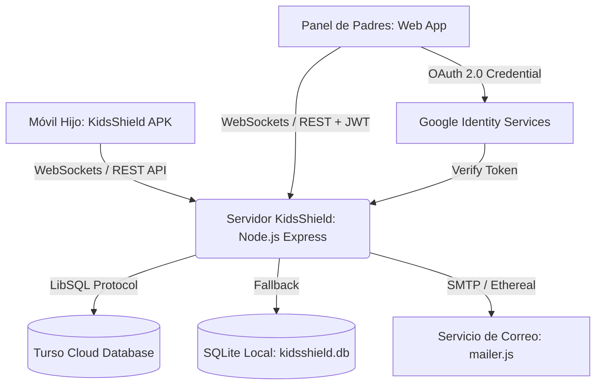

# 🛡️ KidsShield — Plataforma Integral de Control Parental y Bienestar Digital

[](https://nodejs.org/)
[-brightgreen.svg)](https://developer.android.com/)
[](https://turso.tech/)
[](#-seguridad-y-autenticación)
[](#-recuperación-de-contraseña-y-correos)
[](#)

**KidsShield** es una solución tecnológica avanzada y lista para producción diseñada para proteger a niños, niñas y adolescentes en el entorno digital. Combina una aplicación nativa para Android con servicios en segundo plano de alta resiliencia y un panel de control para padres con diseño de vanguardia, sincronización en tiempo real mediante WebSockets, recuperación de contraseña por correo electrónico, compatibilidad con redes Tailscale / LAN y base de datos distribuida en la nube con **Turso (LibSQL)**.

---

## 📑 Tabla de Contenidos

- [Características Principales](#-características-principales)
- [Arquitectura del Sistema](#-arquitectura-del-sistema)
- [Seguridad y Autenticación](#-seguridad-y-autenticación)
- [Navegación Unificada y Vinculación QR](#-navegación-unificada-y-vinculación-qr)
- [Centro de Configuración y Facturación](#-centro-de-configuración-y-facturación)
- [Recuperación de Contraseña y Correos](#-recuperación-de-contraseña-y-correos)
- [Modelo de Monetización y Planes](#-modelo-de-monetización-y-planes)
- [Lugares y Geocercas Seguras con Selección en Mapa](#-lugares-y-geocercas-seguras-con-selección-en-mapa)
- [Captura Automática y Multimedia en Tiempo Real](#-captura-automática-y-multimedia-en-tiempo-real)
- [Bloqueo Infranqueable en la App Android](#-bloqueo-infranqueable-en-la-app-android)
- [Requisitos del Sistema](#-requisitos-del-sistema)
- [Monitoreo en Tiempo Real de Aplicaciones Activas](#-monitoreo-en-tiempo-real-de-aplicaciones-activas)
- [Traza GPS Diaria, Control de Frecuencia Satelital y Alertas](#-traza-gps-diaria-control-de-frecuencia-satelital-y-alertas)
- [Duración Dinámica de Audio y Video (5s, 7s, 10s)](#-duración-dinámica-de-audio-y-video-5s-7s-10s)
- [Sincronización de Bloqueo, Tiempo de Pantalla e Historial](#-sincronización-de-bloqueo-tiempo-de-pantalla-e-historial)
- [Guía de Instalación y Despliegue](#-guía-de-instalación-y-despliegue)
  - [1. Configuración del Servidor y Base de Datos](#1-configuración-del-servidor-y-base-de-datos)
  - [2. Configuración de Google OAuth 2.0](#2-configuración-de-google-oauth-20)
  - [3. Instalación de la App Android en el Teléfono del Menor (Asistente de 6 Pasos)](#3-instalación-de-la-app-android-en-el-teléfono-del-menor-asistente-de-6-pasos)
  - [4. Conectividad Remota con Tailscale o Red Local](#4-conectividad-remota-con-tailscale-o-red-local)
- [Desvinculación y Liberación Remota](#-desvinculación-y-liberación-remota)
- [Modo Micrófono y Monitoreo en Vivo](#-modo-micrófono-y-monitoreo-en-vivo)
- [Estructura del Repositorio](#-estructura-del-repositorio)
- [Recompilación de la App Android](#-recompilación-de-la-app-android)

---

## ✨ Características Principales

- 🧭 **Navegación Unificada Lateral**: Sidebar optimizado con estructura clara (Resumen General, Mi Familia, Dispositivos, Mapa & Geocercas, Multimedia, Historial y Configuración) sin menús redundantes.
- ⚙️ **Centro de Configuración en 2 Apartados**:
  - **1. Configuración de Dispositivos**: Selector contextual de menor con parámetros de GPS, límite diario de pantalla, modo descanso (Bedtime) y PIN parental.
  - **2. Configuración de Pago y Plan**: Tarjeta bancaria virtual interactiva, modal de actualización, conmutador de **Renovación Automática (Auto-Renew)**, cuota de dispositivos e historial de recibos con descarga PDF.
- 📱 **Vinculación Rápida con Código QR Dinámico**: Generador de QR interactivo en modal emergente que despliega el código de emparejamiento familiar y dirección IP del servidor para sincronización instantánea con la cámara del menor.
- 💎 **Gestión de Membresías y Estado Familiar**: Tarjeta lateral con visualización de nivel de suscripción (*Familia Total VIP 💎* / *Familiar Pro ⚡*) y ajuste reactivo del cupo de dispositivos permitidos.
- 🔒 **Bloqueo Inteligente de Aplicaciones y Dispositivo Unificado**: Control remoto inmediato de aplicaciones individuales o bloqueo total del dispositivo. Al bloquear el dispositivo, el menor puede acceder a su pantalla de inicio pero se impide la apertura de cualquier aplicación detectada, cerrándola al instante con expulsión al inicio y pantalla de aviso contextual con PIN parental de rescate.
- 👁️ **Visualización en Vivo sin Obstrucción**: El panel de padres permite observar la pantalla del menor en tiempo real incluso cuando el teléfono se encuentra bloqueado (remoción de la capa opaca "Teléfono Pausado").
- 📍 **Geocercas Seguras con Selección en Mapa**: Marcación con un clic en el mapa satelital para capturar coordenadas al vuelo, validación con feedback visual de campos faltantes (borde rojo), cierre automático del modal al guardar y eliminación definitiva persistente.
- 📸 **Captura Automática Periódica en Multimedia**: Supervisión periódica programada (fotos, clips de vídeo de 5s, grabaciones de audio ambiental de 5s o secuencia mixta) con intervalos de 30s a 5min y temporizador en vivo.
- 🔄 **Galería Multimedia en Tiempo Real**: Recepción instantánea de fotos y clips de video mediante eventos WebSocket dedicados (`MULTIMEDIA_UPDATED`) y peticiones en cascada sin recargar la página.
- 👨‍👩‍👧‍👦 **Administración de Perfiles en "Mi Familia"**: Modificación dinámica de nombre del hijo/a, modelo de terminal, tipo (📱 Celular o 📟 Tablet) y avatar interactivo, sincronizado con base de datos en tiempo real.
- 🚀 **Asistente Inteligente de Permisos Android (6 Pasos)**: Interfaz en el móvil del menor que guía paso a paso al padre o tutor para conceder los permisos del sistema con un solo botón inteligente (*"Otorgar Siguiente Permiso Faltante"*).
- ⏱️ **Límites de Uso y Horarios de Descanso (Bedtime)**: Asignación de tiempo límite diario global o por categoría de app, con bloqueo automático nocturno programable.
- 🚫 **Gestión y Bloqueo de Aplicaciones**: Detección inmediata de aplicaciones no permitidas (TikTok, Roblox, redes sociales) cerrándolas al instante.
- 📍 **Geolocalización Ininterrumpible y Protección GPS**: Monitoreo de ubicación continua en mapa interactivo satelital con detección e impedimento activo de intentos de desactivación de GPS.
- 📧 **Recuperación Segura de Contraseña por Correo**: Sistema con tokens de seguridad criptográficos de 60 minutos de vigencia y plantillas de correo HTML responsivas profesionales vía Nodemailer (SMTP real o Ethereal Mail para pruebas locales).
- 🔓 **Desvinculación y Liberación Remota sin Pérdida de Sesión**: Desvinculación de terminales con liberación inmediata del móvil del menor manteniendo la sesión del padre activa en el panel de control.
- 🎙️ **Modo Micrófono en Vivo**: Monitor ambiental en tiempo real con analizador de audio visual mediante Web Audio API para verificación de entorno seguro.
- 🔋 **Telemetría y Estado de Conectividad Real**: Detección fidedigna del estado en línea/desconectado, modelo de hardware y nivel de batería.
- ⏱️ **Tiempo Real Dinámico de App Activa**: Computación instantánea del tiempo de uso en primer plano (Instagram, WhatsApp, juegos) sin los desfases de bucket del sistema operativo Android, reflejando al instante el tiempo transcurrido en lugar de 0m.
- 📍 **Intervalo GPS Estricto y Sin Alertas Repetitivas**: Sincronización fiel de la frecuencia GPS configurada por los padres (cada 30s, 1m, 5m, 10m). Eliminación de avisos emergentes repetitivos en segundo plano; las alertas solo se activan ante solicitud manual.
- 🗺️ **Traza GPS Completa del Día con Selector**: Historial satelital continuo con selector de fecha (Hoy, Ayer o fecha personalizada), trazando la ruta entera en el mapa satelital Leaflet con marcadores de inicio de recorrido 🏁, fin / última posición 📍, resumen de puntos y cálculo automático de distancia acumulada.
- 🎙️🎬 **Duración Configurable de Audio y Video (5s, 7s, 10s)**: Tarjeta de configuración dedicada en Ajustes de Dispositivos que permite seleccionar 5, 7 o 10 segundos de duración para la escucha ambiental de micrófono y los clips de video en vivo, actualizando los botones de acción reactivamente.
- 🔓 **Sincronización Bidireccional de Bloqueo y Tiempo de Pantalla**: Botón directo de bloqueo/desbloqueo en la tarjeta de Tiempo en Pantalla. Si se desbloquea con el tiempo agotado, otorga automáticamente +15 minutos para permitir su uso normal.
- 🛑🚀⚠️ **Historial Completo con Filtros Específicos y Eventos GPS**: Pestaña de historial con filtros por Bloqueos, Aperturas de Apps, Alertas y Coordenadas GPS con centrado interactivo en el mapa satelital al pulsar.
- 🌐 **Soporte Tailscale / Red Local**: Detección automática de IPs de Tailscale y LAN para emparejamiento y control del dispositivo tanto dentro como fuera de casa sin necesidad de abrir puertos inseguros.
- ☁️ **Base de Datos Distribuida en la Nube**: Integración nativa con **Turso (LibSQL)** para alta disponibilidad y baja latencia global, con fallback automático a SQLite local (`server/kidsshield.db`).

---

## 🏗️ Arquitectura del Sistema



1. **`child-android-app/`**: Aplicación nativa Android (Java 17, SDK 34) implementando:
   - `AccessibilityService`: Monitoreo de ventanas en primer plano, bloqueo de apps restringidas y prevención de apagado de GPS.
   - `UsageStatsManager`: Conteo preciso de minutos de pantalla por paquete.
   - `DeviceAdminReceiver`: Protección contra desinstalación forzada.
   - `ForegroundService`: Persistencia de conexión WebSocket, telemetría y reintentos automáticos.
   - `PowerManager`: Exclusión de optimización de batería (Whitelist Doze) para funcionamiento ininterrumpido.
2. **`server/`**: Servidor Node.js backend con:
   - Motor de WebSockets (`ws`) bidireccional y de baja latencia.
   - Endpoints REST para autenticación, gestión de reglas, telemetría y geofencing.
   - Cliente `@libsql/client` para persistencia en Turso y soporte local offline.
   - Módulo `mailer.js` con soporte para SMTP de producción y auto-cuenta Ethereal en desarrollo.
3. **`parent-dashboard/`**: Single Page Application moderna con estética Glassmorphism, animaciones interactivas, renderizado de mapas interactivos, visualizadores de audio en tiempo real y modal de recuperación de contraseñas.

---

## 🔐 Seguridad y Autenticación

KidsShield ha sido diseñado bajo estándares estrictos de seguridad para entornos productivos:

- **Sin PINs Maestros Inseguros**: Se eliminaron completamente los códigos estáticos o vulnerables.
- **Autenticación con Google OAuth 2.0**: Integración nativa con Google Identity Services con verificación criptográfica en backend y sincronización de foto y nombre de perfil.
- **Autenticación Clásica Robusta**: Soporte para correo/contraseña con cifrado unidireccional `bcryptjs` (salt rounds altos).
- **Sesiones con JWT**: Tokens JSON Web Tokens con tiempo de expiración y firma segura configurable mediante `JWT_SECRET`.
- **Tokens Temporales de Restablecimiento**: Generación de tokens seguros y de uso único con caducidad automática a los 60 minutos.
- **Cero Datos Ficticios**: El panel de control no genera usuarios ni dispositivos simulados; muestra el estado verídico de la base de datos ("Sin dispositivo vinculado" hasta completar la vinculación real).

---

## 🧭 Navegación Unificada y Vinculación QR

El panel de control cuenta con una arquitectura de navegación moderna en el Sidebar lateral:

1. **Estructura Modular del Menú**:
   - 🏠 **Resumen General**: Visión global del estado de todos los dispositivos de los hijos (batería, límites y última actividad).
   - 👨‍👩‍👧‍👦 **Mi Familia**: Administración de miembros del grupo familiar con atajos directos a configuración, mapa y multimedia.
   - 📱 **Dispositivos**: Registro y estado de conectividad en tiempo real de cada terminal supervisado.
   - 📍 **Mapa & Geocercas**: Posicionamiento satelital GPS, zonas seguras (geofences) con radio y ruta histórica con polilíneas.
   - 🎬 **Multimedia**: Galería de capturas remotas y clips de vídeo de 5 segundos.
   - 📜 **Historial**: Línea de tiempo detallada de apertura de aplicaciones y eventos del sistema.
   - ⚙️ **Configuración**: Parámetros técnicos y facturación divididos por apartados.

2. **Generador Dinámico de Códigos QR**:
   - Al pulsar en **"Vincular Nuevo Dispositivo"** o el icono de QR de cualquier hijo, se abre un modal interactivo con el código QR renderizado al vuelo mediante `qrcode.js`.
   - Incluye el código alfanumérico familiar y la URL/IP del servidor detectada (red local o Tailscale) con botones de copiado en 1 clic.

---

## ⚙️ Centro de Configuración y Facturación

El Centro de Configuración ha sido reestructurado en **dos apartados especializados** accesibles mediante un selector segmentado moderno:

### 📱 Apartado 1: Configuración de Dispositivos
Permite ajustar las directivas de seguridad aplicadas al teléfono seleccionado:
- **Selector Contextual de Hijo**: Permite alternar instantáneamente entre los dispositivos de la familia.
- **📍 Rastreo y Ubicación GPS**: Conmutador de activación remota y selector de frecuencia de actualización (15s, 30s, 1m, 2m, 5m).
- **⏳ Límite Diario de Pantalla**: Control deslizante interactivo (15 a 600 minutos) con visualizador en horas y minutos.
- **🌙 Modo Descanso (Horario Nocturno / Bedtime)**: Conmutador y selectores de hora de inicio (`settingsBedtimeStart`) y hora de fin (`settingsBedtimeEnd`).
- **🔑 PIN Parental de Seguridad**: Código de 4 dígitos para desbloqueo de emergencia o autorizaciones presenciales en el móvil.

### 💳 Apartado 2: Configuración de Pago y Plan
Gestión integral de suscripción y facturación conectada al backend:
- **Tarjeta Bancaria Virtual**: Simulación estética con chip dorado, emisor VISA, número enmascarado (`•••• 4242`), titular y vencimiento.
- **Modal de Actualización de Tarjeta**: Formulario con validación de emisor (Visa, Mastercard, Amex), número, expiración y CVC.
- **🔄 Renovación Automática (Auto-Renew)**: Conmutador en tiempo real con persistencia en base de datos (`auto_renew` en Turso/SQLite) y proyección de la fecha del próximo ciclo de cobro.
- **Cuota de Dispositivos**: Indicador dinámico del cupo de terminales según el plan activo (*Hasta 5 teléfonos en Familiar Pro* / *Hasta 10 teléfonos en Familia Total VIP*).
- **📋 Historial de Pagos y Recibos**: Registro de facturación con descripción del servicio, fecha, ID de transacción, método de pago, monto, estado (`✓ Pagado`) y botón para descargar recibos en PDF.

---

## 📧 Recuperación de Contraseña y Correos

El servidor incluye un módulo dedicado de mensajería transaccional (`server/mailer.js`):

1. **Modo Producción**: Al configurar variables de entorno SMTP (`SMTP_HOST`, `SMTP_PORT`, `SMTP_USER`, `SMTP_PASS`), los correos se envían a través de tu proveedor de correo habitual (Gmail, SendGrid, Amazon SES, Mailgun, etc.).
2. **Modo Desarrollo / Pruebas**: Si no configuras variables SMTP, KidsShield crea automáticamente una cuenta de pruebas gratuita en **Ethereal Email** e imprime en la consola del servidor el enlace web directo para previsualizar el correo generado.
3. **Plantilla HTML de Alto Nivel**: Incluye diseño en modo oscuro con gradientes, logotipo de seguridad, botón interactivo directo y advertencias claras de expiración.

---

## 💰 Modelo de Monetización y Planes

El sistema incluye estructura de datos y gestión de suscripciones para familias:

| Plan | Dispositivos | Funcionalidades | Precio Sugerido |
| :--- | :---: | :--- | :---: |
| **Básico (Trial)** | 1 Teléfono | Bloqueo remoto, monitoreo de batería y límite de tiempo básico. | Gratis / 14 días |
| **Pro Familiar** | Hasta 5 Teléfonos | Reglas por app, Bedtime automático, geolocalización continua y alertas. | $4.99 USD / mes |
| **Total Family + Audio** | Ilimitados | Todo lo anterior + Escucha remota / Modo Micrófono en tiempo real, capturas remotas y soporte prioritario. | $9.99 USD / mes |

---

## 📍 Lugares y Geocercas Seguras con Selección en Mapa

El módulo de Geocercas ofrece control geográfico perimetral intuitivo y dinámico:

1. **Selección de Puntos con 1 Clic en el Mapa**:
   - Al explorar el mapa satelital (tanto en el resumen general como en la vista dedicada de mapa), hacer clic en cualquier ubicación coloca un pin temporal interactivo con las coordenadas exactas (`lat`, `lng`) y el botón **"➕ Establecer Geocerca Aquí"**.
   - Al pulsar el botón, se abre automáticamente el modal de creación de geocerca con la latitud y longitud ya precargadas.
2. **Validación Visual Reactiva**:
   - Si se intenta guardar una geocerca y falta el **Nombre**, la **Latitud** o la **Longitud**, el sistema resalta el campo en rojo brillante (`#ef4444`), enfoca el input de inmediato y muestra una notificación Toast guiando al usuario.
   - Tan pronto el usuario introduce texto en el campo señalado, el resaltado de error se limpia de forma automática.
3. **Cierre Automático al Guardar**:
   - Tras guardar exitosamente el nuevo lugar seguro, el modal se cierra solo devolviendo al usuario a la vista del mapa con los nuevos círculos Leaflet dibujados.
4. **Eliminación Definitiva y Persistente**:
   - Los lugares seguros pueden eliminarse con confirmación. La fila se atenúa visualmente (UI optimista), se envía la orden de eliminación a la base de datos y se retira el círculo del mapa en tiempo real, garantizando que no reaparezcan al volver a ingresar.

---

## 📸 Captura Automática y Multimedia en Tiempo Real

El área de Multimedia (`parent-dashboard/`) cuenta con automatización continua y sincronización instantánea:

1. **Captura Automática Periódica**:
   - **Selector de Modo**: 📸 Foto / Pantalla en vivo, 🎥 Clip de Vídeo (5s), 🎙️ Grabación de Audio Ambiental (5s) o 🔄 Secuencia Mixta rotativa.
   - **Intervalos Programables**: Frecuencia de 30 segundos, 1 minuto, 2 minutos o 5 minutos.
   - **Control y Monitoreo en Vivo**: Botón de activación / detención rápida con badge visual (`ACTIVA` / `Inactiva`) y cronómetro regresivo en segundos que indica el momento del próximo disparo automático.
2. **Galería Reactiva sin Recargas**:
   - Al recibir una nueva captura o clip desde el móvil del menor, el servidor propaga un evento WebSocket (`MULTIMEDIA_UPDATED`), provocando que la galería se actualice automáticamente en milisegundos sin requerir que el padre cambie de pestaña ni recargue la página.
3. **Visualización Continua en Dispositivos Bloqueados**:
   - Se eliminó cualquier velo u obstrucción ("Teléfono Pausado") en el simulador de pantalla del panel web, permitiendo a los padres monitorear la pantalla en tiempo real incluso durante los periodos en que el teléfono del menor permanece bloqueado.

---

## 🛡️ Bloqueo Inteligente de Aplicaciones y Dispositivo Unificado

El módulo Android (`child-android-app/`) implementa un sistema unificado y robusto para el bloqueo de aplicaciones individuales y el bloqueo general del dispositivo:

1. **Bloqueo Remoto de Aplicaciones Individuales**:
   - Desde la pestaña de Dispositivos en el panel de padres, el tutor puede bloquear o desbloquear cualquier aplicación detectada (por ejemplo: YouTube, TikTok, juegos o redes sociales).
   - El servidor transmite la orden de inmediato por WebSockets (`COMMAND` con `BLOCK_APP:<pkg>` o `UNBLOCK_APP:<pkg>`) y actualiza la lista sincronizada de aplicaciones bloqueadas.
   - `AppBlockerAccessibilityService`: En cuanto el menor pulsa el icono de la aplicación restringida, el servicio detecta el paquete en primer plano, ejecuta instantáneamente `GLOBAL_ACTION_HOME` para cerrar la aplicación y levanta la pantalla `LockOverlayActivity` indicando el nombre de la app y la razón de bloqueo.

2. **Bloqueo Completo del Dispositivo (Modo Universal "Todas las Apps Detectadas")**:
   - Al activar el bloqueo remoto del dispositivo desde el panel de padres (`isDeviceLocked = true`), el sistema funciona con la misma mecánica que el bloqueo de aplicaciones individuales, pero extendido a **todas las aplicaciones detectadas** en el teléfono del menor.
   - El menor puede visualizar su pantalla de inicio (launcher de Android) e interactuar con el sistema sin congelamientos ni pantallas negras forzadas.
   - Tan pronto el menor intenta abrir **cualquier aplicación** (juegos, navegador, redes sociales, etc.), el servicio de accesibilidad lo detecta al instante, lo expulsa de inmediato al inicio (`GLOBAL_ACTION_HOME`) y muestra la pantalla `LockOverlayActivity` con el aviso *"🔒 Dispositivo Bloqueado"* y la indicación de la app que se intentó iniciar.
   - El botón **"Volver al inicio"** permanece accesible para que el menor retorne limpiamente al escritorio.

3. **Excepciones de Seguridad y Emergencia Garantizadas**:
   - Por seguridad vital, el sistema de bloqueo permite siempre el acceso a:
     - Teléfono y llamadas de emergencia (`com.android.phone`, marcador telefónico del sistema).
     - Componentes del sistema operativo e interfaz de usuario (`com.android.systemui`).
     - Lanzador de aplicaciones principal (Home launcher dinámico).
     - La propia aplicación de KidsShield para sincronización y configuración parental.
   - Protege activamente la pantalla de Ajustes del sistema (`com.android.settings`) para impedir que se apague el GPS, se desinstale la app o se revoquen los permisos.

4. **Persistencia y Resiliencia en Segundo Plano**:
   - `ParentalConfig`: Persistencia dual en `SharedPreferences` (Set de Strings y cadena CSV sanitizada en minúsculas) garantizando que las listas de apps restringidas no se pierdan entre reinicios o actualizaciones.
   - Estado de protección activo por defecto (`protection_active = true`), evitando que servicios en segundo plano desactiven las reglas de bloqueo.
   - Desbloqueo de emergencia mediante **PIN Parental**: El padre o tutor puede ingresar el PIN en la pantalla de bloqueo del menor para obtener 15 minutos de uso libre o desbloquear permanentemente.

---

## 📋 Requisitos del Sistema

### Servidor / Panel Web:
- **Node.js**: Versión 18.0.0 o superior.
- **NPM**: Versión 8.0.0 o superior.
- **Conexión a Internet**: Para sincronización con Turso Cloud, Google Auth y envío de correos.

### Dispositivo del Menor (Android):
- **Sistema Operativo**: Android 8.0 (Oreo / API 26) hasta Android 14 (Upside Down Cake / API 34).
- **Servicios de Google Play**: Compatibilidad total.

---

## 🚀 Guía de Instalación y Despliegue

### 1. Configuración del Servidor y Base de Datos

1. Clona o descarga el repositorio en tu máquina:
   ```bash
   git clone https://github.com/sebastianbriones-g/KidsShield.git
   cd KidsShield
   ```
2. Instala las dependencias del servidor:
   ```bash
   cd server
   npm install
   ```
3. Configura las variables de entorno creando o editando el archivo `server/.env`:
   ```env
   PORT=3000
   JWT_SECRET=tu_clave_secreta_super_segura_2026

   # Base de Datos Distribuida (Opcional - Fallback a SQLite local)
   TURSO_DATABASE_URL=libsql://tu-base-de-datos.turso.io
   TURSO_AUTH_TOKEN=tu_token_de_autenticacion_turso

   # Google OAuth 2.0 (Opcional)
   GOOGLE_CLIENT_ID=tu_cliente_id_google.apps.googleusercontent.com

   # Servidor SMTP de Correo (Opcional - Fallback automático a Ethereal Email)
   SMTP_HOST=smtp.gmail.com
   SMTP_PORT=587
   SMTP_SECURE=false
   SMTP_USER=tucorreo@gmail.com
   SMTP_PASS=tu_contraseña_de_aplicacion
   SMTP_FROM="KidsShield Soporte" <soporte@tudominio.com>
   ```

4. Inicia el servidor:
   ```bash
   npm start
   ```
   *O haz doble clic en `iniciar-panel.bat` en Windows.*

5. Accede al panel en tu navegador:
   👉 **http://localhost:3000**

---

### 2. Configuración de Google OAuth 2.0

Para habilitar el botón oficial de inicio de sesión con Google:
1. Ve a [Google Cloud Console](https://console.cloud.google.com/) y crea un proyecto.
2. Configura la **Pantalla de consentimiento de OAuth** (agrega tu dominio o `http://localhost:3000`).
3. En **Credenciales**, crea un **ID de cliente de OAuth 2.0** tipo *Aplicación web*.
4. Agrega como orígenes de JavaScript autorizados:
   - `http://localhost:3000`
   - `http://127.0.0.1:3000`
5. En el panel de KidsShield, haz clic en **"Configurar Google Client ID"**, pega tu Client ID y guarda. ¡El botón de Google se activará al instante!

---

### 3. Instalación de la App Android en el Teléfono del Menor (Asistente de 6 Pasos)

1. Transfiere el archivo **`KidsShield-v1.0.apk`** (o `KidsShield-v1.0.0-release.apk`) al teléfono del menor.
2. Toca el archivo descargado para comenzar la instalación y autoriza **"Instalar desde esta fuente"**.
3. **Alerta de Google Play Protect:**
   - Si el dispositivo muestra una advertencia de aplicación desconocida, pulsa en **"Más detalles"** (o flecha ▾).
   - Selecciona **"Instalar de todas formas"**.
4. Abre **KidsShield**. El nuevo **Asistente de Permisos Guiado** verificará automáticamente cada permiso y te permitirá concederlos con el botón *"Otorgar Siguiente Permiso Faltante"*:
   - 1️⃣ **Acceso a Datos de Uso (Usage Access)**: Contabiliza con exactitud los minutos utilizados en apps, redes sociales y juegos.
   - 2️⃣ **Servicio de Accesibilidad (A11y)**: Detección instantánea en milisegundos de aplicaciones bloqueadas y protección del GPS.
   - 3️⃣ **Superposición en Pantalla (Draw Over Apps)**: Despliega la pantalla de bloqueo seguro sobre cualquier aplicación cuando venza el horario o límite.
   - 4️⃣ **Ubicación GPS Satelital Ininterrumpible**: Rastreo continuo 24/7 y prevención de desactivación por parte del menor.
   - 5️⃣ **Administrador de Dispositivo (Device Admin)**: Previene que el menor desinstale la aplicación o fuerce su detención.
   - 6️⃣ **Sin Restricción de Batería (Segundo Plano)**: Evita que el sistema operativo mate el proceso en segundo plano para ahorrar energía.
5. Escanea el código QR desde el panel web o ingresa el código de vinculación familiar para conectar el teléfono en tiempo real.

---

### 4. Conectividad Remota con Tailscale o Red Local

El servidor detecta automáticamente tu dirección IP local y tu IP de la red privada **Tailscale**:

* **En casa:** Si ambos dispositivos están en la misma red Wi-Fi, la app se conecta a la IP local del servidor (ej. `http://192.168.1.50:3000`).
* **Fuera de casa (Tailscale VPN):** Al instalar Tailscale en el PC servidor y en el móvil del menor, ambos se comunican de forma segura a través de la IP de Tailscale (ej. `http://100.x.y.z:3000` o `http://note:3000`) desde cualquier lugar del mundo sin exponer puertos al internet público.

---

## 🔓 Desvinculación y Liberación Remota

Si decides transferir el teléfono, cambiar de dispositivo o desactivar temporalmente el control parental:
1. Desde el panel web de padres, haz clic en **"Desvincular Dispositivo"** o elimina el perfil del menor.
2. El servidor marcará el dispositivo como desvinculado, limpiará su historial de ubicaciones y eventos de Turso Cloud, y enviará en tiempo real la orden `UNLINK_DEVICE` y `UNLOCK_DEVICE`.
3. El teléfono del menor cerrará inmediatamente la pantalla de bloqueo y restaurará los accesos de inmediato, sin requerir reinicios forzados.

---

## ⏱️ Monitoreo en Tiempo Real de Aplicaciones Activas

A diferencia de soluciones tradicionales que dependen del cierre de la app para que Android liquide los minutos en `UsageStatsManager`, KidsShield integra un algoritmo de cálculo dinámico:
1. **Detección Continua:** El servicio de accesibilidad (`AppBlockerAccessibilityService`) notifica en tiempo real cuál es el paquete que se encuentra en primer plano.
2. **Cómputo en Vivo en el Servidor:** `server/index.js` registra la marca de tiempo de inicio de la app activa (`currentActiveAppStartedAt`).
3. **Preservación de Historial:** Al procesar reportes periódicos, el servidor nunca disminuye el tiempo acumulado si la app está en uso, sumando los minutos de sesión en curso.
4. **Visualización en Vivo:** El panel muestra de forma inmediata `En uso hoy: Xm`, evitando que permanezca en `0m` mientras el menor navega en Instagram, WhatsApp o cualquier otra aplicación.

---

## 📍 Traza GPS Diaria, Control de Frecuencia Satelital y Alertas

El módulo de geolocalización satelital fue refinado para máxima confiabilidad y economía de batería:
- **Respeto de Frecuencia:** Si los padres definen una actualización cada 10 minutos (600s), el dispositivo móvil del menor suspende consultas redundantes de GPS cada 6 segundos, ejecutándolas únicamente al vencer el intervalo o ante un comando explícito de actualización inmediata.
- **Supresión de Spam en Alertas:** Se eliminaron las notificaciones emergentes invasivas por actualizaciones automáticas de fondo. Los mensajes de confirmación de coordenadas se reservan exclusivamente para cuando el padre o tutor pulsa de forma intencional el botón manual **"Actualizar"**.
- **Traza Completa del Día:**
  - Selector de fecha integrado: `Hoy`, `Ayer` o fecha personalizada mediante calendario nativo.
  - Generación de polilínea continua en el mapa Leaflet con hasta 1000 puntos cronológicos.
  - Marcador de inicio de jornada 🏁 (azul) y marcador de última posición 📍 (rojo) con popups interactivos de hora exacta.
  - Estadísticas automáticas con el total de posiciones registradas y la distancia total recorrida (m o km).

---

## 🎙️🎬 Duración Dinámica de Audio y Video (5s, 7s, 10s)

Desde la pestaña de **Configuración de Dispositivos**:
- Los padres pueden configurar individualmente el tiempo de captura para:
  - **Audio Ambiental:** 5 segundos (rápido), 7 segundos (estándar) o 10 segundos (extendido).
  - **Video en Vivo:** 5 segundos (10 fotogramas), 7 segundos (14 fotogramas) o 10 segundos (20 fotogramas a ~500ms).
- Los botones de la interfaz web (`Video (Xs)` y `Audio (Ys)`) se actualizan automáticamente en tiempo real.
- Las órdenes remotas se transmiten por WebSocket y HTTP al dispositivo móvil con la duración precisa solicitada.

---

## 🔒 Sincronización de Bloqueo, Tiempo de Pantalla e Historial

- **Interacción Bidireccional:** El botón de bloqueo directo en la tarjeta de Tiempo en Pantalla conversa fluidamente con los límites diarios: si el tiempo del menor se agotó (quedando bloqueado) y el padre pulsa "Desbloquear", el sistema otorga automáticamente **+15 minutos** para desbloquear el terminal sin fricciones.
- **Filtros Específicos en el Historial:** El registro de actividad cuenta con pestañas de filtrado rápido:
  - 🛑 **Bloqueos:** Intentos de apertura fuera de hora o apps prohibidas.
  - 🚀 **Aperturas:** Registro de apps iniciadas por el menor.
  - ⚠️ **Alertas:** Batería baja, GPS apagado o desinstalación intentada.
  - 📍 **GPS:** Puntos de ubicación satelital con botón para centrar y enfocar en el mapa al instante.

---

## 🎙️ Modo Micrófono y Monitoreo en Vivo

El panel web incorpora una tarjeta de monitoreo de audio en vivo:
1. Permite iniciar una escucha de control ambiental para situaciones de emergencia o alerta de seguridad.
2. Muestra un analizador de espectro de frecuencias en tiempo real generado por **Web Audio API**.
3. Notifica inmediatamente al padre el nivel de decibelios y presencia de ruido en el entorno del menor.

---

## 📁 Estructura del Repositorio

```text
KidsShield/
├── KidsShield-v1.0.apk             # Binario APK v1.0 listo para instalar
├── KidsShield-v1.0.0.apk           # Binario APK estándar
├── KidsShield-v1.0.0-release.apk   # Binario APK firmado para producción
├── iniciar-panel.bat               # Script de inicio rápido con detección de IPs para Windows
├── README.md                       # Documentación principal en español
├── LEEME.md                        # Documentación complementaria sincronizada
├── .gitignore                      # Reglas de exclusión para Git
├── parent-dashboard/               # Frontend del Panel de Control de Padres
│   ├── index.html                  # Interfaz con Glassmorphism y modal de recuperación
│   ├── app.js                      # Lógica cliente, WebSockets, Audio API, Auth y Reset
│   ├── style.css                   # Hoja de estilos con tokens CSS y diseño responsive
│   └── KidsShield-v1.0.apk         # Copia directa descargable desde el panel web
├── server/                         # Backend en Node.js
│   ├── index.js                    # Servidor Express, WebSockets y controladores de API
│   ├── db.js                       # Capa de datos Turso LibSQL / SQLite
│   ├── mailer.js                   # Módulo de correos con nodemailer y plantillas HTML
│   ├── package.json                # Dependencias del servidor (express, ws, nodemailer, etc.)
│   └── .env.example                # Plantilla de variables de entorno
└── child-android-app/              # Código fuente nativo de la app Android
    ├── app/                        # Módulo principal Android (Java 17, SDK 34)
    ├── build.gradle                # Configuración de compilación Gradle
    └── gradlew.bat                 # Wrapper de Gradle para compilación
```

---

## 🛠️ Recompilación de la App Android

Si deseas realizar modificaciones en la aplicación nativa (`child-android-app/`):

1. Asegúrate de tener instalado **JDK 17** y **Android SDK Build Tools 34.0.0**.
2. Compila el paquete de release:
   ```powershell
   cd child-android-app
   .\gradlew.bat assembleRelease
   ```
3. El APK optimizado y firmado se generará en:
   ```text
   child-android-app\app\build\outputs\apk\release\app-release.apk
   ```

---

## 📄 Licencia y Aviso Legal

Este software ha sido diseñado con fines exclusivos de control parental, bienestar digital y supervisión de menores de edad bajo la tutela de sus padres o tutores legales. El uso no autorizado o con fines de vigilancia ilícita está estrictamente prohibido.
